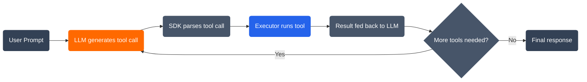
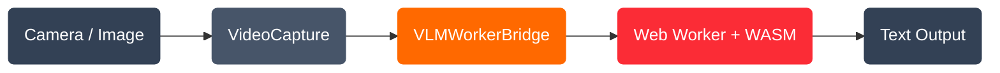
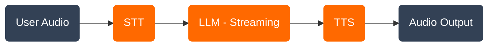

# Best Practices
Source: https://docs.runanywhere.ai/web/best-practices

Tips for building great browser AI experiences

<Note>**Early Beta** -- The Web SDK is in early beta. APIs may change between releases.</Note>

## Overview

This guide covers best practices for building performant, reliable, and user-friendly AI applications with the RunAnywhere Web SDK in the browser.

## Model Selection

### Choose the Right Model Size

| Model Size     | RAM Required | Use Case               | Speed     |
| -------------- | ------------ | ---------------------- | --------- |
| 360M-500M (Q4) | \~300-500MB  | Quick responses, chat  | Very Fast |
| 1B-3B (Q4)     | 1-2GB        | Balanced quality/speed | Fast      |
| 7B (Q4)        | 4-5GB        | High quality           | Slower    |

<Warning>
  Browser memory is more limited than native apps. Models larger than 2GB may cause tab crashes on
  devices with limited RAM. Start with smaller models and test on target devices.
</Warning>

### Quantization Trade-offs

| Quantization | Quality    | Size    | Speed   |
| ------------ | ---------- | ------- | ------- |
| Q8\_0        | Best       | Largest | Slower  |
| Q6\_K        | Great      | Large   | Fast    |
| Q4\_K\_M     | Good       | Medium  | Faster  |
| Q4\_0        | Acceptable | Small   | Fastest |

<Tip>
  For browser use, Q4\_0 and Q4\_K\_M offer the best balance of quality and memory efficiency. Start
  with smaller quantizations and only increase if output quality is insufficient.
</Tip>

## Performance Optimization

### Use Streaming for Better UX

```typescript theme={null}
import { TextGeneration } from '@runanywhere/web-llamacpp'

// Bad: User waits for entire response
const result = await TextGeneration.generate(prompt, { maxTokens: 500 })
document.getElementById('output')!.textContent = result.text

// Good: User sees response as it's generated
const { stream } = await TextGeneration.generateStream(prompt, { maxTokens: 500 })
let text = ''
for await (const token of stream) {
  text += token
  document.getElementById('output')!.textContent = text
}
```

### Enable Cross-Origin Isolation

Multi-threaded WASM is significantly faster. Always configure COOP/COEP headers:

```typescript theme={null}
import { LlamaCPP } from '@runanywhere/web-llamacpp'

// Check after backend registration
await LlamaCPP.register()
console.log('Acceleration:', LlamaCPP.accelerationMode) // 'webgpu' or 'cpu'

if (!crossOriginIsolated) {
  console.warn('Running in single-threaded mode. Add COOP/COEP headers for better performance.')
}
```

### Exclude WASM Packages from Vite Pre-Bundling

This is the most common gotcha with Vite:

```typescript vite.config.ts theme={null}
export default defineConfig({
  optimizeDeps: {
    exclude: ['@runanywhere/web-llamacpp', '@runanywhere/web-onnx'],
  },
})
```

Without this, `import.meta.url` resolves to the wrong paths and WASM files won't be found.

### Limit Token Generation

```typescript theme={null}
import { TextGeneration } from '@runanywhere/web-llamacpp'

// For quick responses
const { stream } = await TextGeneration.generateStream(prompt, {
  maxTokens: 100,
  temperature: 0.5,
})

// For detailed responses
const { stream: detailedStream } = await TextGeneration.generateStream(prompt, {
  maxTokens: 500,
  temperature: 0.7,
})
```

### Batch DOM Updates

For fast token generation, throttle UI updates to avoid rendering bottlenecks:

```typescript theme={null}
let pending = ''
let frameId: number | null = null

function appendToken(token: string) {
  pending += token
  if (!frameId) {
    frameId = requestAnimationFrame(() => {
      document.getElementById('output')!.textContent = pending
      frameId = null
    })
  }
}
```

## Model Management

### Use OPFS for Persistent Storage

Download models to OPFS so they persist across browser sessions:

```typescript theme={null}
import { RunAnywhere, ModelManager, ModelCategory, LLMFramework, EventBus } from '@runanywhere/web'

RunAnywhere.registerModels([
  {
    id: 'lfm2-350m-q4_k_m',
    name: 'LFM2 350M',
    repo: 'LiquidAI/LFM2-350M-GGUF',
    files: ['LFM2-350M-Q4_K_M.gguf'],
    framework: LLMFramework.LlamaCpp,
    modality: ModelCategory.Language,
    memoryRequirement: 250_000_000,
  },
])

// First visit: download model
await ModelManager.downloadModel('lfm2-350m-q4_k_m')
await ModelManager.loadModel('lfm2-350m-q4_k_m')

// Subsequent visits: model loads from OPFS (no re-download)
```

### Show Download Progress

```typescript theme={null}
import { EventBus } from '@runanywhere/web'

EventBus.shared.on('model.downloadProgress', (evt) => {
  const percent = ((evt.progress ?? 0) * 100).toFixed(0)
  document.getElementById('progress')!.textContent = `Downloading: ${percent}%`
})
```

### Handle Large Model Downloads

Models over \~200MB can crash the browser tab, especially on memory-constrained devices. Mitigations:

```typescript theme={null}
// Check available memory before downloading
if ('deviceMemory' in navigator) {
  const memoryGB = (navigator as any).deviceMemory
  const modelSizeMB = 250

  if (memoryGB < 4 && modelSizeMB > 200) {
    console.warn('Low memory device — large model downloads may fail.')
  }
}

// Monitor for download stalls (no progress for 30s may indicate trouble)
let lastProgress = 0
let lastTime = Date.now()

EventBus.shared.on('model.downloadProgress', (evt) => {
  const progress = evt.progress ?? 0
  if (progress > lastProgress) {
    lastProgress = progress
    lastTime = Date.now()
  } else if (Date.now() - lastTime > 30000) {
    console.warn('Download appears stalled. Tab may be running low on memory.')
  }
})
```

<Warning>
  If the browser tab crashes during a model download, the partial download is stored in OPFS. On the
  next attempt, `ModelManager.downloadModel()` will resume from where it left off. Recommend
  starting with smaller models (LFM2 350M at \~250MB) before attempting larger ones.
</Warning>

### Use `coexist` for Multi-Model Loading

When loading multiple models (e.g., for voice pipeline), pass `coexist: true`:

```typescript theme={null}
await ModelManager.loadModel('silero-vad-v5', { coexist: true })
await ModelManager.loadModel('sherpa-onnx-whisper-tiny.en', { coexist: true })
await ModelManager.loadModel('lfm2-350m-q4_k_m', { coexist: true })
await ModelManager.loadModel('vits-piper-en_US-lessac-medium', { coexist: true })
```

### Idempotent SDK Initialization

Wrap initialization in a cached-promise pattern so it's safe to call from multiple components:

```typescript theme={null}
let _initPromise: Promise<void> | null = null

export async function initSDK(): Promise<void> {
  if (_initPromise) return _initPromise
  _initPromise = (async () => {
    await RunAnywhere.initialize({ environment: SDKEnvironment.Development, debug: true })
    await LlamaCPP.register()
    await ONNX.register()
    RunAnywhere.registerModels(MODELS)
  })()
  return _initPromise
}
```

## Hosted IDE & Iframe Environments

### Replit, CodeSandbox, StackBlitz

These platforms run your app inside an iframe, which has important implications:

| Limitation             | Impact                                | Workaround                                   |
| ---------------------- | ------------------------------------- | -------------------------------------------- |
| No `SharedArrayBuffer` | WASM runs single-threaded (slower)    | Access app directly, not via iframe preview  |
| Memory constraints     | Large models (>200MB) may crash       | Use smaller models (350M-500M params, Q4\_0) |
| COOP header conflict   | `same-origin` breaks iframe embedding | SDK falls back gracefully; no action needed  |
| Preview URL differs    | CORS/COEP may behave differently      | Test with the published URL, not the preview |

<Warning>
  **Do not use `COEP: require-corp`** in hosted IDE environments. It will block Vite's internal
  `/@fs/` module serving and cause "non-JavaScript MIME type" errors for worker scripts and WASM
  glue files. Always use `COEP: credentialless`.
</Warning>

### SPA Routing and Static Assets

When using a custom Express/Node server with SPA catch-all routing, **static asset routes must come before the catch-all**. Otherwise, `.wasm`, `.js`, and worker files get served as `index.html`:

```typescript theme={null}
// WRONG ORDER — catch-all swallows WASM requests:
app.get('*', (req, res) => res.sendFile('index.html'))
app.use(express.static('dist')) // Never reached for .wasm files

// CORRECT ORDER — static files served first:
app.use(
  express.static('dist', {
    setHeaders: (res, path) => {
      if (path.endsWith('.wasm')) {
        res.setHeader('Content-Type', 'application/wasm')
      }
    },
  })
)
app.get('*', (req, res) => {
  if (!req.path.match(/\.(js|css|wasm|json|png|svg|woff2?)$/)) {
    res.sendFile('index.html', { root: 'dist' })
  } else {
    res.status(404).end()
  }
})
```

## Browser-Specific Considerations

### Handle Tab Visibility

Cancel in-progress generation when the tab is hidden:

```typescript theme={null}
import { TextGeneration } from '@runanywhere/web-llamacpp'

document.addEventListener('visibilitychange', () => {
  if (document.hidden) {
    TextGeneration.cancel()
  }
})
```

### Handle Memory Pressure

```typescript theme={null}
if ('deviceMemory' in navigator) {
  const memory = (navigator as any).deviceMemory // GB
  if (memory < 4) {
    console.warn('Low memory device. Use smaller models.')
  }
}
```

### Safari Considerations

* OPFS has known reliability issues in Safari -- test thoroughly
* WebGPU is not available in Safari (as of early 2026)
* Prefer Chrome/Edge for the best experience

### Mobile Browser Considerations

* Mobile browsers have stricter memory limits
* Models larger than 1GB may cause tab crashes
* Use Q4\_0 quantization for mobile
* Test on actual mobile devices

### Camera Permission Handling

Provide clear error messages for camera permissions (important for VLM):

```typescript theme={null}
try {
  const camera = new VideoCapture({ facingMode: 'environment' })
  await camera.start()
} catch (err) {
  const msg = (err as Error).message
  if (msg.includes('NotAllowed') || msg.includes('Permission')) {
    alert('Camera permission denied. Check System Settings → Privacy & Security → Camera.')
  } else if (msg.includes('NotFound')) {
    alert('No camera found on this device.')
  } else if (msg.includes('NotReadable')) {
    alert('Camera is in use by another application.')
  }
}
```

## Error Handling

### Always Handle Errors Gracefully

```typescript theme={null}
import { SDKError, SDKErrorCode } from '@runanywhere/web'
import { TextGeneration } from '@runanywhere/web-llamacpp'

async function generateSafely(prompt: string): Promise<string> {
  try {
    const { stream, result } = await TextGeneration.generateStream(prompt, { maxTokens: 200 })
    let text = ''
    for await (const token of stream) {
      text += token
    }
    return text
  } catch (err) {
    if (err instanceof SDKError) {
      switch (err.code) {
        case SDKErrorCode.ModelNotLoaded:
          return 'Please load a model first.'
        case SDKErrorCode.GenerationCancelled:
          return ''
        default:
          return 'Sorry, an error occurred. Please try again.'
      }
    }
    return 'An unexpected error occurred.'
  }
}
```

## Security & Privacy

### All Data Stays Local

The Web SDK runs entirely in the browser via WebAssembly. No data is sent to any server. This is a key advantage for privacy-sensitive applications.

### Use Correct Environment Mode

```typescript theme={null}
// Development: Full logging
await RunAnywhere.initialize({ environment: SDKEnvironment.Development, debug: true })

// Production: Minimal logging
await RunAnywhere.initialize({ environment: SDKEnvironment.Production })
```

## Vite Gotchas Summary

| Issue                            | Fix                                                                                |
| -------------------------------- | ---------------------------------------------------------------------------------- |
| WASM files not found             | Add `optimizeDeps.exclude: ['@runanywhere/web-llamacpp', '@runanywhere/web-onnx']` |
| Web Workers not bundling         | Add `worker: { format: 'es' }`                                                     |
| WASM not served in dev           | Add `assetsInclude: ['**/*.wasm']`                                                 |
| VLM Worker TypeScript error      | Use `@ts-ignore` above `?worker&url` import                                        |
| WASM missing in production build | Add `copyWasmPlugin()` to copy WASM to `dist/assets/`                              |
| Single-threaded mode             | Add COOP/COEP headers to `server.headers`                                          |
| WASM served as HTML in prod      | Ensure static file serving comes **before** SPA catch-all route                    |
| Worker "MIME type" error         | Use `COEP: credentialless` (NOT `require-corp`); fix SPA catch-all route ordering  |
| Camera "source width is 0"       | Wait for `loadedmetadata` event before calling `captureFrame()`                    |

## Summary Checklist

<Check>Install all three packages: `@runanywhere/web`, `web-llamacpp`, `web-onnx`</Check>
<Check>Register backends with `LlamaCPP.register()` and `ONNX.register()`</Check>
<Check>Choose appropriate model size for browser memory constraints</Check>
<Check>Use streaming for better perceived performance</Check>
<Check>Configure Cross-Origin Isolation headers (`COEP: credentialless`, NOT `require-corp`)</Check>
<Check>Add `optimizeDeps.exclude` in Vite config for WASM packages</Check>
<Check>Add `copyWasmPlugin()` to copy WASM files for production builds</Check>
<Check>Serve static assets (`.wasm`, `.js`) BEFORE SPA catch-all routes</Check>
<Check>Set `Content-Type: application/wasm` for `.wasm` files on custom servers</Check>
<Check>Use OPFS for persistent model storage via `ModelManager`</Check>
<Check>Use `coexist: true` when loading multiple models simultaneously</Check>
<Check>Wait for `loadedmetadata` before calling `VideoCapture.captureFrame()`</Check>
<Check>For voice pipeline: load all 4 models (VAD + STT + LLM + TTS) — VAD alone is not STT</Check>
<Check>Handle all error cases gracefully including WASM memory crashes</Check>
<Check>Show progress during model downloads via `EventBus`</Check>
<Check>Batch DOM updates during fast token streaming</Check>
<Check>Test on target browsers and devices (not just iframe previews)</Check>

## Related

<CardGroup>
  <Card title="Configuration" icon="gear" href="/web/configuration">
    SDK configuration
  </Card>

  <Card title="Error Handling" icon="triangle-exclamation" href="/web/error-handling">
    Handle errors gracefully
  </Card>

  <Card title="Quick Start" icon="rocket" href="/web/quick-start">
    Getting started guide
  </Card>
</CardGroup>


# Configuration
Source: https://docs.runanywhere.ai/web/configuration

SDK configuration and settings

<Note>**Early Beta** -- The Web SDK is in early beta. APIs may change between releases.</Note>

## Overview

This guide covers SDK initialization options, backend registration, model management, events, browser capabilities, and audio utilities.

## SDK Initialization

### Basic Initialization

```typescript theme={null}
import { RunAnywhere, SDKEnvironment } from '@runanywhere/web'
import { LlamaCPP } from '@runanywhere/web-llamacpp'
import { ONNX } from '@runanywhere/web-onnx'

// Step 1: Initialize core SDK
await RunAnywhere.initialize({
  environment: SDKEnvironment.Development,
  debug: true,
})

// Step 2: Register backends (loads WASM automatically)
await LlamaCPP.register() // LLM + VLM
await ONNX.register() // STT + TTS + VAD
```

### Full Configuration

```typescript theme={null}
interface SDKInitOptions {
  /** SDK environment */
  environment?: SDKEnvironment // Development | Staging | Production

  /** Enable debug logging */
  debug?: boolean

  /** API key for authentication (optional) */
  apiKey?: string

  /** Base URL for API requests */
  baseURL?: string

  /** Acceleration preference */
  acceleration?: AccelerationPreference // 'auto' | 'webgpu' | 'cpu'

  /** Custom URL for WebGPU WASM glue */
  webgpuWasmUrl?: string
}
```

### Backend Registration

After initializing the core SDK, register the inference backends you need:

```typescript theme={null}
import { LlamaCPP } from '@runanywhere/web-llamacpp'
import { ONNX } from '@runanywhere/web-onnx'

// LlamaCpp: LLM text generation + VLM vision
await LlamaCPP.register()
console.log('LlamaCpp registered:', LlamaCPP.isRegistered)
console.log('Acceleration:', LlamaCPP.accelerationMode) // 'webgpu' or 'cpu'

// ONNX (sherpa-onnx): STT + TTS + VAD
await ONNX.register()
```

<Warning>
  Backend registration loads WASM binaries and can take a few seconds. Always `await` the register
  calls before using any inference APIs. Registration is idempotent -- calling it multiple times is
  safe.
</Warning>

## Environment Modes

| Environment | Enum Value                   | Description                       | Logging |
| ----------- | ---------------------------- | --------------------------------- | ------- |
| Development | `SDKEnvironment.Development` | Local development, full debugging | Debug   |
| Staging     | `SDKEnvironment.Staging`     | Testing with real services        | Info    |
| Production  | `SDKEnvironment.Production`  | Production deployment             | Warning |

## Logging

### Configure Log Level

```typescript theme={null}
import { SDKLogger, LogLevel } from '@runanywhere/web'

SDKLogger.level = LogLevel.Debug // Trace | Debug | Info | Warning | Error | Fatal
SDKLogger.enabled = true
```

### Log Levels

| Level     | Description             | Use Case    |
| --------- | ----------------------- | ----------- |
| `Trace`   | Very detailed tracing   | Deep debug  |
| `Debug`   | Detailed debugging info | Development |
| `Info`    | General information     | Staging     |
| `Warning` | Potential issues        | Production  |
| `Error`   | Errors and failures     | Production  |
| `Fatal`   | Critical failures       | Always      |

## Events

### EventBus

The SDK provides a typed event system for monitoring SDK activities:

```typescript theme={null}
import { EventBus } from '@runanywhere/web'

// Subscribe to model download progress
const unsubscribe = EventBus.shared.on('model.downloadProgress', (evt) => {
  console.log(`Model: ${evt.modelId}, Progress: ${((evt.progress ?? 0) * 100).toFixed(0)}%`)
})

EventBus.shared.on('model.loadCompleted', (evt) => {
  console.log(`Model loaded: ${evt.modelId}`)
})

// Clean up
unsubscribe()
```

<Note>
  Event properties are directly on the event object (e.g., `evt.modelId`, `evt.progress`), not
  nested under `evt.data`.
</Note>

### Event Types

| Event                     | Description                                     |
| ------------------------- | ----------------------------------------------- |
| `model.downloadProgress`  | Model download progress (`modelId`, `progress`) |
| `model.downloadCompleted` | Model download finished                         |
| `model.loadCompleted`     | Model loaded into memory                        |
| `model.unloaded`          | Model unloaded                                  |
| `generation.started`      | Text generation started                         |
| `generation.completed`    | Text generation completed                       |
| `generation.failed`       | Text generation failed                          |

## Model Sources

All models in RunAnywhere are sourced from **[HuggingFace](https://huggingface.co)**. The SDK provides a model registry that resolves compact model definitions into full download URLs and manages the complete lifecycle: registration -> download -> storage -> loading.

### How It Works


When you register a model with a `repo` field, the SDK constructs the download URL automatically:

```
https://huggingface.co/{repo}/resolve/main/{filename}
```

For example, `repo: 'LiquidAI/LFM2-350M-GGUF'` with `files: ['LFM2-350M-Q4_K_M.gguf']` resolves to:

```
https://huggingface.co/LiquidAI/LFM2-350M-GGUF/resolve/main/LFM2-350M-Q4_K_M.gguf
```

### CompactModelDef

The `registerModels` API accepts an array of compact model definitions:

```typescript theme={null}
import { ModelCategory, LLMFramework } from '@runanywhere/web'

interface CompactModelDef {
  /** Unique identifier for the model */
  id: string

  /** Human-readable model name */
  name: string

  /** Inference backend */
  framework: LLMFramework // LLMFramework.LlamaCpp | LLMFramework.ONNX

  /** Model category (determines which engine handles it) */
  modality: ModelCategory
  // ModelCategory.Language         — LLM text generation
  // ModelCategory.Multimodal       — VLM image + text
  // ModelCategory.SpeechRecognition — STT
  // ModelCategory.SpeechSynthesis   — TTS
  // ModelCategory.Audio             — VAD

  /** HuggingFace repo path (e.g., 'LiquidAI/LFM2-350M-GGUF') */
  repo?: string

  /** Model files in the repo. First file = primary, rest = additional (e.g., mmproj for VLM) */
  files?: string[]

  /** Direct URL (alternative to repo + files) */
  url?: string

  /** 'archive' for tar.gz bundles (STT/TTS), omit for individual GGUF files */
  artifactType?: 'archive'

  /** Estimated memory requirement in bytes */
  memoryRequirement?: number
}
```

### URL Resolution Rules

| Config                            | URL Pattern                                         | Use Case                     |
| --------------------------------- | --------------------------------------------------- | ---------------------------- |
| `repo` + `files`                  | `https://huggingface.co/{repo}/resolve/main/{file}` | Most models (LLM, VLM)       |
| `url` only                        | Used as-is                                          | Direct links, non-HF sources |
| `url` + `artifactType: 'archive'` | Used as-is, extracted after download                | STT/TTS model bundles        |

## Model Management

All model management operations use `ModelManager` from `@runanywhere/web`.

### Register Models

```typescript theme={null}
import { RunAnywhere, ModelCategory, LLMFramework } from '@runanywhere/web'

RunAnywhere.registerModels([
  // LLM: Liquid AI LFM2
  {
    id: 'lfm2-350m-q4_k_m',
    name: 'LFM2 350M Q4_K_M',
    repo: 'LiquidAI/LFM2-350M-GGUF',
    files: ['LFM2-350M-Q4_K_M.gguf'],
    framework: LLMFramework.LlamaCpp,
    modality: ModelCategory.Language,
    memoryRequirement: 250_000_000,
  },

  // VLM: Liquid AI LFM2-VL (two files: model + mmproj)
  {
    id: 'lfm2-vl-450m-q4_0',
    name: 'LFM2-VL 450M Q4_0',
    repo: 'runanywhere/LFM2-VL-450M-GGUF',
    files: ['LFM2-VL-450M-Q4_0.gguf', 'mmproj-LFM2-VL-450M-Q8_0.gguf'],
    framework: LLMFramework.LlamaCpp,
    modality: ModelCategory.Multimodal,
    memoryRequirement: 500_000_000,
  },

  // STT: Whisper (archive bundle from direct URL)
  {
    id: 'sherpa-onnx-whisper-tiny.en',
    name: 'Whisper Tiny English (ONNX)',
    url: 'https://huggingface.co/runanywhere/sherpa-onnx-whisper-tiny.en/resolve/main/sherpa-onnx-whisper-tiny.en.tar.gz',
    framework: LLMFramework.ONNX,
    modality: ModelCategory.SpeechRecognition,
    memoryRequirement: 105_000_000,
    artifactType: 'archive' as const,
  },

  // TTS: Piper (archive bundle)
  {
    id: 'vits-piper-en_US-lessac-medium',
    name: 'Piper TTS US English (Lessac)',
    url: 'https://huggingface.co/runanywhere/vits-piper-en_US-lessac-medium/resolve/main/vits-piper-en_US-lessac-medium.tar.gz',
    framework: LLMFramework.ONNX,
    modality: ModelCategory.SpeechSynthesis,
    memoryRequirement: 65_000_000,
    artifactType: 'archive' as const,
  },

  // VAD: Silero (single ONNX file)
  {
    id: 'silero-vad-v5',
    name: 'Silero VAD v5',
    url: 'https://huggingface.co/runanywhere/silero-vad-v5/resolve/main/silero_vad.onnx',
    files: ['silero_vad.onnx'],
    framework: LLMFramework.ONNX,
    modality: ModelCategory.Audio,
    memoryRequirement: 5_000_000,
  },
])
```

### Available Models on HuggingFace

#### LLM Models

| Model              | HuggingFace Repo                                                                            | Size    | Notes                             |
| ------------------ | ------------------------------------------------------------------------------------------- | ------- | --------------------------------- |
| **LFM2 350M**      | [`LiquidAI/LFM2-350M-GGUF`](https://huggingface.co/LiquidAI/LFM2-350M-GGUF)                 | \~250MB | Liquid AI, ultra-compact          |
| **LFM2 1.2B Tool** | [`LiquidAI/LFM2-1.2B-Tool-GGUF`](https://huggingface.co/LiquidAI/LFM2-1.2B-Tool-GGUF)       | \~800MB | Liquid AI, tool-calling optimized |
| Qwen 2.5 0.5B      | [`Qwen/Qwen2.5-0.5B-Instruct-GGUF`](https://huggingface.co/Qwen/Qwen2.5-0.5B-Instruct-GGUF) | \~400MB | Multilingual                      |

#### VLM Models

| Model            | HuggingFace Repo                                                                                          | Size    | Notes                   |
| ---------------- | --------------------------------------------------------------------------------------------------------- | ------- | ----------------------- |
| **LFM2-VL 450M** | [`runanywhere/LFM2-VL-450M-GGUF`](https://huggingface.co/runanywhere/LFM2-VL-450M-GGUF)                   | \~500MB | Liquid AI, smallest VLM |
| SmolVLM 500M     | [`runanywhere/SmolVLM-500M-Instruct-GGUF`](https://huggingface.co/runanywhere/SmolVLM-500M-Instruct-GGUF) | \~500MB | HuggingFace SmolVLM     |
| Qwen2-VL 2B      | [`runanywhere/Qwen2-VL-2B-Instruct-GGUF`](https://huggingface.co/runanywhere/Qwen2-VL-2B-Instruct-GGUF)   | \~1.5GB | Higher quality          |

#### STT / TTS / VAD Models

| Model              | URL                                          | Size    | Notes            |
| ------------------ | -------------------------------------------- | ------- | ---------------- |
| Whisper Tiny EN    | `runanywhere/sherpa-onnx-whisper-tiny.en`    | \~105MB | Archive bundle   |
| Piper TTS (Lessac) | `runanywhere/vits-piper-en_US-lessac-medium` | \~65MB  | Archive bundle   |
| Silero VAD v5      | `runanywhere/silero-vad-v5`                  | \~5MB   | Single ONNX file |

### Download and Load

```typescript theme={null}
import { ModelManager, ModelCategory, EventBus } from '@runanywhere/web'

// Track download progress
EventBus.shared.on('model.downloadProgress', (evt) => {
  console.log(`Downloading ${evt.modelId}: ${((evt.progress ?? 0) * 100).toFixed(0)}%`)
})

// Download to OPFS (persists across sessions)
await ModelManager.downloadModel('lfm2-350m-q4_k_m')

// Load into memory for inference
await ModelManager.loadModel('lfm2-350m-q4_k_m')

// Check loaded models
const allModels = ModelManager.getModels()
const loaded = ModelManager.getLoadedModel(ModelCategory.Language)
console.log('Loaded:', loaded?.id)
```

### Multi-Model Loading with `coexist`

By default, loading a new model unloads any previously loaded model. For the voice pipeline (which needs STT + LLM + TTS + VAD simultaneously), pass `coexist: true`:

```typescript theme={null}
// Load all 4 voice models without unloading each other
await ModelManager.loadModel('silero-vad-v5', { coexist: true })
await ModelManager.loadModel('sherpa-onnx-whisper-tiny.en', { coexist: true })
await ModelManager.loadModel('lfm2-350m-q4_k_m', { coexist: true })
await ModelManager.loadModel('vits-piper-en_US-lessac-medium', { coexist: true })
```

### Storage (OPFS)

Downloaded models are persisted in the browser's **Origin Private File System (OPFS)**. This means:

* Models survive page refreshes and browser restarts
* Each origin (domain) has its own isolated storage
* The SDK auto-detects previously downloaded models on page load
* If storage quota is exceeded, the SDK auto-evicts least-recently-used models

<Warning>
  **Large model downloads (>200MB) can crash the browser tab** on memory-constrained devices. The
  OPFS write buffers data in memory before committing. If the tab crashes mid-download, refresh and
  retry — the SDK can resume partial downloads. Start with smaller models (LFM2 350M at \~250MB)
  before attempting larger ones (Qwen2-VL 2B at \~1.5GB).
</Warning>

### Delete Models

```typescript theme={null}
import { ModelManager } from '@runanywhere/web'

// Delete a specific model from OPFS
await ModelManager.deleteModel('lfm2-350m-q4_k_m')
```

## Audio Utilities

<Note>
  Audio utilities (`AudioCapture`, `AudioPlayback`) are in `@runanywhere/web-onnx`, while video
  utilities (`VideoCapture`) are in `@runanywhere/web-llamacpp`. Don't mix up the import sources.
</Note>

### AudioCapture (Microphone)

`AudioCapture` is in `@runanywhere/web-onnx`. Configuration is passed to the constructor, and callbacks are passed to `start()`:

```typescript theme={null}
import { AudioCapture } from '@runanywhere/web-onnx'

const capture = new AudioCapture({ sampleRate: 16000 })

await capture.start(
  (chunk: Float32Array) => {
    // Process audio samples (e.g., feed to VAD)
  },
  (level: number) => {
    // Audio level 0.0-1.0 (for UI visualization)
  }
)

// Stop when done
capture.stop()
```

### AudioPlayback (Speaker)

`AudioPlayback` is in `@runanywhere/web-onnx`:

```typescript theme={null}
import { AudioPlayback } from '@runanywhere/web-onnx'

const player = new AudioPlayback({ sampleRate: 22050 })

await player.play(audioFloat32Array, 22050)

// Clean up resources
player.dispose()
```

### VideoCapture (Camera)

`VideoCapture` is in `@runanywhere/web-llamacpp`:

```typescript theme={null}
import { VideoCapture } from '@runanywhere/web-llamacpp'

const camera = new VideoCapture({ facingMode: 'environment' }) // or 'user' for selfie
await camera.start()

// Add the video preview to the DOM
document.getElementById('preview')!.appendChild(camera.videoElement)

// Capture a frame (downscaled to 256px max dimension)
const frame = camera.captureFrame(256)
// frame.rgbPixels: Uint8Array (RGB, no alpha)
// frame.width, frame.height: actual dimensions

// Check state
console.log('Is capturing:', camera.isCapturing)

camera.stop()
```

## Acceleration

### GPU Acceleration

The SDK auto-detects WebGPU availability when `LlamaCPP.register()` is called:

```typescript theme={null}
import { LlamaCPP } from '@runanywhere/web-llamacpp'

await LlamaCPP.register()
console.log('Acceleration:', LlamaCPP.accelerationMode) // 'webgpu' or 'cpu'
```

| Mode     | Description                                            |
| -------- | ------------------------------------------------------ |
| `webgpu` | WebGPU detected and WASM loaded successfully           |
| `cpu`    | CPU-only WASM (WebGPU not available or failed to load) |

<Note>
  If the WebGPU WASM file returns a 404, the SDK gracefully falls back to CPU mode. This is normal
  behavior -- check `LlamaCPP.accelerationMode` to confirm which mode is active.
</Note>

## Related

<CardGroup>
  <Card title="Error Handling" icon="triangle-exclamation" href="/web/error-handling">
    Handle errors gracefully
  </Card>

  <Card title="Best Practices" icon="star" href="/web/best-practices">
    Optimization tips
  </Card>
</CardGroup>


# Error Handling
Source: https://docs.runanywhere.ai/web/error-handling

Handle SDK errors gracefully

<Note>**Early Beta** -- The Web SDK is in early beta. APIs may change between releases.</Note>

## Overview

The RunAnywhere Web SDK provides structured error handling through `SDKError` with specific error codes. This guide covers error types, handling patterns, and recovery strategies.

## SDKError Structure

```typescript theme={null}
import { SDKError, SDKErrorCode } from '@runanywhere/web'

class SDKError extends Error {
  readonly code: SDKErrorCode
  readonly details?: string
  readonly message: string
}
```

## Checking for SDK Errors

```typescript theme={null}
import { SDKError, SDKErrorCode } from '@runanywhere/web'
import { TextGeneration } from '@runanywhere/web-llamacpp'

try {
  const { stream, result } = await TextGeneration.generateStream('Hello', { maxTokens: 100 })
  for await (const token of stream) {
    /* ... */
  }
} catch (err) {
  if (err instanceof SDKError) {
    console.log('Code:', err.code)
    console.log('Message:', err.message)
    console.log('Details:', err.details)
  } else {
    console.error('Unexpected error:', err)
  }
}
```

## Error Codes

### Initialization Errors

| Code                   | Value | Description             | Recovery                           |
| ---------------------- | ----- | ----------------------- | ---------------------------------- |
| `NotInitialized`       | -100  | SDK not initialized     | Call `RunAnywhere.initialize()`    |
| `AlreadyInitialized`   | -101  | SDK already initialized | Use existing instance or `reset()` |
| `InvalidConfiguration` | -102  | Invalid config options  | Check initialization options       |
| `InitializationFailed` | -103  | Init failed             | Check browser compatibility        |

### Model Errors

| Code                 | Value | Description           | Recovery                              |
| -------------------- | ----- | --------------------- | ------------------------------------- |
| `ModelNotFound`      | -110  | Model not in registry | Register model first                  |
| `ModelLoadFailed`    | -111  | Failed to load model  | Check model path, format              |
| `ModelInvalidFormat` | -112  | Unsupported format    | Use GGUF or ONNX                      |
| `ModelNotLoaded`     | -113  | No model loaded       | Call `ModelManager.loadModel()` first |

### Generation Errors

| Code                  | Value | Description            | Recovery                      |
| --------------------- | ----- | ---------------------- | ----------------------------- |
| `GenerationFailed`    | -130  | Text generation failed | Check model, reduce tokens    |
| `GenerationCancelled` | -131  | Generation cancelled   | Expected if `cancel()` called |
| `GenerationTimeout`   | -132  | Generation timed out   | Reduce maxTokens              |

### Download Errors

| Code             | Value | Description     | Recovery                    |
| ---------------- | ----- | --------------- | --------------------------- |
| `DownloadFailed` | -160  | Download failed | Check network, CORS headers |

### Storage Errors

| Code           | Value | Description              | Recovery                |
| -------------- | ----- | ------------------------ | ----------------------- |
| `StorageError` | -180  | Storage operation failed | Check OPFS availability |

### WASM Errors

| Code             | Value | Description                | Recovery                              |
| ---------------- | ----- | -------------------------- | ------------------------------------- |
| `WASMLoadFailed` | -900  | WASM module failed to load | Check WASM file paths, bundler config |
| `WASMNotLoaded`  | -901  | WASM module not loaded     | Register backends first               |

## Static Factory Methods

`SDKError` provides convenient factory methods:

```typescript theme={null}
SDKError.notInitialized()
SDKError.wasmNotLoaded()
SDKError.modelNotFound('my-model')
SDKError.generationFailed('Context window exceeded')
SDKError.fromRACResult(resultCode, 'details')
```

## Handling Patterns

### Basic Error Handling

```typescript theme={null}
import { SDKError, SDKErrorCode } from '@runanywhere/web'
import { TextGeneration } from '@runanywhere/web-llamacpp'

try {
  const { stream } = await TextGeneration.generateStream(prompt, { maxTokens: 200 })
  for await (const token of stream) {
    /* update UI */
  }
} catch (err) {
  if (err instanceof SDKError) {
    switch (err.code) {
      case SDKErrorCode.NotInitialized:
        console.error('SDK not initialized — call RunAnywhere.initialize() first')
        break
      case SDKErrorCode.ModelNotLoaded:
        console.error('No model loaded — call ModelManager.loadModel() first')
        break
      case SDKErrorCode.GenerationFailed:
        console.error('Generation failed:', err.details)
        break
      case SDKErrorCode.GenerationCancelled:
        break
      default:
        console.error(`SDK error [${err.code}]: ${err.message}`)
    }
  }
}
```

### WASM Memory Crash Handling

VLM inference can occasionally trigger WASM memory errors. These are recoverable:

```typescript theme={null}
import { VLMWorkerBridge } from '@runanywhere/web-llamacpp'

try {
  const result = await VLMWorkerBridge.shared.process(rgbPixels, width, height, prompt, options)
} catch (err) {
  const msg = (err as Error).message
  if (msg.includes('memory access out of bounds') || msg.includes('RuntimeError')) {
    // Recoverable — skip this frame and retry
    console.warn('WASM crash, will retry next frame')
  } else {
    throw err
  }
}
```

### WASM Binary Served as HTML (Production)

In production, if your server has a SPA catch-all route that serves `index.html` for unknown paths, `.wasm` file requests will return HTML instead of the binary. The WASM compiler receives HTML bytes and throws:

```
CompileError: WebAssembly.instantiate(): expected magic word 00 61 73 6d, found 3c 21 44 4f
```

The bytes `3c 21 44 4f` decode to `<!DO` — the start of an HTML document. **Fix:** ensure static asset serving (with correct MIME types) comes before SPA catch-all routing. See [Installation troubleshooting](/web/installation#wasm-loads-html-instead-of-binary-production).

### Camera "source width is 0"

Calling `VideoCapture.captureFrame()` before the video stream is fully initialized causes:

```
Failed to execute 'getImageData' on 'CanvasRenderingContext2D': The source width is 0.
```

**Fix:** Wait for the video element's `loadedmetadata` event or check `videoElement.videoWidth > 0` before capturing. See [VLM camera readiness](/web/vlm#waiting-for-camera-readiness).

### VLM Worker "non-JavaScript MIME type"

```
Failed to load module script: The server responded with a non-JavaScript MIME type of "text/html"
```

The VLM Web Worker URL is resolving to your SPA's `index.html`. **Fix:**

1. Use `COEP: credentialless` (not `require-corp`)
2. Ensure `.js` files are served as static assets before the catch-all route
3. Add `worker: { format: 'es' }` to your Vite config

### Retry Logic

```typescript theme={null}
async function withRetry<T>(operation: () => Promise<T>, maxRetries = 2): Promise<T> {
  let lastError: Error | null = null

  for (let attempt = 0; attempt <= maxRetries; attempt++) {
    try {
      return await operation()
    } catch (err) {
      lastError = err as Error

      if (!(err instanceof SDKError)) throw err

      if (
        [
          SDKErrorCode.NotInitialized,
          SDKErrorCode.ModelNotFound,
          SDKErrorCode.ModelInvalidFormat,
          SDKErrorCode.GenerationCancelled,
        ].includes(err.code)
      ) {
        throw err
      }

      if (attempt < maxRetries) {
        await new Promise((r) => setTimeout(r, 1000 * (attempt + 1)))
        continue
      }
    }
  }

  throw lastError
}
```

### User-Friendly Messages

```typescript theme={null}
function getUserMessage(err: SDKError): string {
  switch (err.code) {
    case SDKErrorCode.NotInitialized:
      return 'The AI system is still loading. Please wait.'
    case SDKErrorCode.ModelNotLoaded:
      return 'No AI model is loaded. Please download a model first.'
    case SDKErrorCode.GenerationFailed:
      return 'Failed to generate a response. Please try again.'
    case SDKErrorCode.GenerationCancelled:
      return 'Response generation was cancelled.'
    case SDKErrorCode.WASMLoadFailed:
      return 'Failed to load the AI engine. Please refresh the page.'
    case SDKErrorCode.DownloadFailed:
      return 'Model download failed. Check your internet connection.'
    case SDKErrorCode.StorageError:
      return 'Storage error. Try clearing browser data and reloading.'
    default:
      return err.message || 'An unexpected error occurred.'
  }
}
```

### React Error Hook

```typescript useSDKError.ts theme={null}
import { useState, useCallback } from 'react'
import { SDKError, SDKErrorCode } from '@runanywhere/web'

export function useSDKError() {
  const [error, setError] = useState<SDKError | null>(null)

  const handleError = useCallback((err: unknown) => {
    if (err instanceof SDKError) {
      setError(err)
    } else {
      console.error('Unexpected error:', err)
    }
  }, [])

  const clearError = useCallback(() => setError(null), [])

  const canRetry = error
    ? ![
        SDKErrorCode.NotInitialized,
        SDKErrorCode.ModelNotFound,
        SDKErrorCode.WASMNotLoaded,
      ].includes(error.code)
    : false

  return { error, handleError, clearError, canRetry }
}
```

## Logging Errors

```typescript theme={null}
import { SDKLogger, LogLevel } from '@runanywhere/web'

SDKLogger.level = LogLevel.Error

try {
  const { stream } = await TextGeneration.generateStream(prompt)
  for await (const token of stream) {
    /* ... */
  }
} catch (err) {
  if (err instanceof SDKError) {
    console.error(`[${err.code}] ${err.message}`, err.details)
  }
}
```

## Related

<CardGroup>
  <Card title="Configuration" icon="gear" href="/web/configuration">
    SDK configuration
  </Card>

  <Card title="Best Practices" icon="star" href="/web/best-practices">
    Optimization tips
  </Card>
</CardGroup>


# Installation
Source: https://docs.runanywhere.ai/web/installation

Add the RunAnywhere Web SDK to your project

<Note>**Early Beta** -- The Web SDK is in early beta. APIs may change between releases.</Note>

## Package Installation

The Web SDK is split into three packages. Install all three to access every feature, or pick only the backends you need:

```bash theme={null}
npm install @runanywhere/web @runanywhere/web-llamacpp @runanywhere/web-onnx
```

Or with yarn:

```bash theme={null}
yarn add @runanywhere/web @runanywhere/web-llamacpp @runanywhere/web-onnx
```

### Package Breakdown

| Package                     | Version        | What's Inside                                                                                                                              |
| --------------------------- | -------------- | ------------------------------------------------------------------------------------------------------------------------------------------ |
| `@runanywhere/web`          | `0.1.0-beta.9` | Core SDK: `RunAnywhere`, `ModelManager`, `ModelCategory`, `EventBus`, `VoicePipeline`, `SDKEnvironment`, `LLMFramework`, `CompactModelDef` |
| `@runanywhere/web-llamacpp` | `0.1.0-beta.9` | LLM/VLM backend: `LlamaCPP`, `TextGeneration`, `VLMWorkerBridge`, `VideoCapture`, `startVLMWorkerRuntime`                                  |
| `@runanywhere/web-onnx`     | `0.1.0-beta.9` | STT/TTS/VAD backend: `ONNX`, `AudioCapture`, `AudioPlayback`, `VAD`, `SpeechActivity`                                                      |

<Info>
  If you only need LLM text generation, you can skip `@runanywhere/web-onnx`. If you only need
  STT/TTS/VAD, you can skip `@runanywhere/web-llamacpp`. The core `@runanywhere/web` package is
  always required.
</Info>

## Bundler Configuration

### Vite (Recommended)

The starter app uses Vite. Here is the complete `vite.config.ts` that handles WASM serving, Cross-Origin Isolation, Web Workers, and production builds:

```typescript vite.config.ts theme={null}
import { defineConfig, type Plugin } from 'vite'
import react from '@vitejs/plugin-react'
import path from 'path'
import fs from 'fs'
import { fileURLToPath } from 'url'

const __dir = path.dirname(fileURLToPath(import.meta.url))

/**
 * Copies WASM binaries from @runanywhere npm packages into dist/assets/
 * for production builds. In dev mode Vite serves node_modules directly.
 */
function copyWasmPlugin(): Plugin {
  const llamacppWasm = path.resolve(__dir, 'node_modules/@runanywhere/web-llamacpp/wasm')
  const onnxWasm = path.resolve(__dir, 'node_modules/@runanywhere/web-onnx/wasm')

  return {
    name: 'copy-wasm',
    writeBundle(options) {
      const outDir = options.dir ?? path.resolve(__dir, 'dist')
      const assetsDir = path.join(outDir, 'assets')
      fs.mkdirSync(assetsDir, { recursive: true })

      // LlamaCpp WASM binaries (LLM/VLM)
      for (const file of [
        'racommons-llamacpp.wasm',
        'racommons-llamacpp.js',
        'racommons-llamacpp-webgpu.wasm',
        'racommons-llamacpp-webgpu.js',
      ]) {
        const src = path.join(llamacppWasm, file)
        if (fs.existsSync(src)) {
          fs.copyFileSync(src, path.join(assetsDir, file))
        }
      }

      // Sherpa-ONNX: copy all files in sherpa/ subdirectory (STT/TTS/VAD)
      const sherpaDir = path.join(onnxWasm, 'sherpa')
      const sherpaOut = path.join(assetsDir, 'sherpa')
      if (fs.existsSync(sherpaDir)) {
        fs.mkdirSync(sherpaOut, { recursive: true })
        for (const file of fs.readdirSync(sherpaDir)) {
          fs.copyFileSync(path.join(sherpaDir, file), path.join(sherpaOut, file))
        }
      }
    },
  }
}

export default defineConfig({
  plugins: [react(), copyWasmPlugin()],
  server: {
    headers: {
      'Cross-Origin-Opener-Policy': 'same-origin',
      'Cross-Origin-Embedder-Policy': 'credentialless',
    },
  },
  assetsInclude: ['**/*.wasm'],
  worker: { format: 'es' },
  optimizeDeps: {
    // CRITICAL: exclude WASM packages from pre-bundling so import.meta.url
    // resolves correctly for automatic WASM file discovery
    exclude: ['@runanywhere/web-llamacpp', '@runanywhere/web-onnx'],
  },
})
```

<Warning>
  **`optimizeDeps.exclude` is critical.** Without excluding the WASM packages from Vite's
  pre-bundling, `import.meta.url` resolves to the wrong paths and WASM files won't be found at
  runtime. This is the most common cause of "WASM not loading" errors with Vite.
</Warning>

### Webpack

```javascript webpack.config.js theme={null}
module.exports = {
  module: {
    rules: [{ test: /\.wasm$/, type: 'asset/resource' }],
  },
}
```

### Next.js

```javascript next.config.js theme={null}
/** @type {import('next').NextConfig} */
const nextConfig = {
  async headers() {
    return [
      {
        source: '/(.*)',
        headers: [
          { key: 'Cross-Origin-Opener-Policy', value: 'same-origin' },
          { key: 'Cross-Origin-Embedder-Policy', value: 'credentialless' },
        ],
      },
    ]
  },
  webpack: (config) => {
    config.module.rules.push({
      test: /\.wasm$/,
      type: 'asset/resource',
    })
    return config
  },
}

module.exports = nextConfig
```

## Cross-Origin Isolation Headers

For multi-threaded WASM (significantly better performance), your server must set two HTTP headers:

```
Cross-Origin-Opener-Policy: same-origin
Cross-Origin-Embedder-Policy: credentialless
```

These enable `SharedArrayBuffer`, which is required for multi-threaded WASM. Without them, the SDK falls back to single-threaded mode.

<Warning>
  **Always use `credentialless`, NOT `require-corp` for COEP.** Using `require-corp` will break WASM
  loading in most setups because it requires every sub-resource (including Vite's `/@fs/` served
  files, CDN assets, fonts, and worker scripts) to include a `Cross-Origin-Resource-Policy` header.
  In practice, `require-corp` causes silent failures where module scripts get blocked with
  "non-JavaScript MIME type" errors. Use `credentialless` — it enables `SharedArrayBuffer` without
  breaking cross-origin resource loading.
</Warning>

<Warning>
  **Iframe environments (Replit, CodeSandbox, StackBlitz):** The `Cross-Origin-Opener-Policy:
      same-origin` header breaks iframe embedding because the parent and child frames are on different
  origins. In these environments, `SharedArrayBuffer` will NOT be available regardless of your
  header configuration. The SDK will fall back to **single-threaded WASM mode**, which still works
  but is slower. This is an environment limitation, not a bug. When accessed directly (not in an
  iframe), the headers work correctly.
</Warning>

### Server Configuration

<Tabs>
  <Tab title="Vercel">
    ```json vercel.json theme={null}
    {
      "headers": [
        {
          "source": "/(.*)",
          "headers": [
            { "key": "Cross-Origin-Opener-Policy", "value": "same-origin" },
            { "key": "Cross-Origin-Embedder-Policy", "value": "credentialless" }
          ]
        },
        {
          "source": "/assets/(.*).wasm",
          "headers": [
            { "key": "Content-Type", "value": "application/wasm" },
            { "key": "Cache-Control", "value": "public, max-age=31536000, immutable" }
          ]
        }
      ]
    }
    ```
  </Tab>

  <Tab title="Netlify">
    ```toml netlify.toml theme={null}
    [[headers]]
      for = "/*"
      [headers.values]
        Cross-Origin-Opener-Policy = "same-origin"
        Cross-Origin-Embedder-Policy = "credentialless"

    [[headers]]
    for = "/assets/\*.wasm"
    [headers.values]
    Content-Type = "application/wasm"
    Cache-Control = "public, max-age=31536000, immutable"

    ```
  </Tab>

  <Tab title="Cloudflare Pages">
    Create a `_headers` file in the project root:

    ```

    /\*
    Cross-Origin-Opener-Policy: same-origin
    Cross-Origin-Embedder-Policy: credentialless

    /assets/\*.wasm
    Content-Type: application/wasm
    Cache-Control: public, max-age=31536000, immutable

    ```
  </Tab>

  <Tab title="Nginx">
    ```nginx nginx.conf theme={null}
    server {
        listen 443 ssl;
        server_name app.example.com;

        add_header Cross-Origin-Opener-Policy "same-origin" always;
        add_header Cross-Origin-Embedder-Policy "credentialless" always;

        types {
            application/wasm wasm;
        }

        location ~* \.wasm$ {
            add_header Cross-Origin-Opener-Policy "same-origin" always;
            add_header Cross-Origin-Embedder-Policy "credentialless" always;
            add_header Cache-Control "public, max-age=31536000, immutable";
        }
    }
    ```
  </Tab>

  <Tab title="Apache">
    ```apache .htaccess theme={null}
    <IfModule mod_headers.c>
        Header always set Cross-Origin-Opener-Policy "same-origin"
        Header always set Cross-Origin-Embedder-Policy "credentialless"
    </IfModule>

    AddType application/wasm .wasm

    ```
  </Tab>
</Tabs>

## Package Contents

### `@runanywhere/web-llamacpp`

| Component                        | Description                                                     | Size    |
| -------------------------------- | --------------------------------------------------------------- | ------- |
| TypeScript API                   | `TextGeneration`, `VLMWorkerBridge`, `VideoCapture`, `LlamaCPP` | \~50KB  |
| `racommons-llamacpp.wasm`        | CPU WASM binary (llama.cpp)                                     | \~3.6MB |
| `racommons-llamacpp.js`          | CPU WASM glue code                                              | \~200KB |
| `racommons-llamacpp-webgpu.wasm` | WebGPU WASM binary (optional)                                   | \~4MB   |
| `racommons-llamacpp-webgpu.js`   | WebGPU WASM glue code (optional)                                | \~200KB |

### `@runanywhere/web-onnx`

| Component           | Description                                                      | Size   |
| ------------------- | ---------------------------------------------------------------- | ------ |
| TypeScript API      | `ONNX`, `AudioCapture`, `AudioPlayback`, `VAD`, `SpeechActivity` | \~30KB |
| `sherpa/` directory | sherpa-onnx WASM + glue (STT/TTS/VAD)                            | \~12MB |

<Note>
  The sherpa-onnx WASM module is only loaded when you call `ONNX.register()`. If you only need LLM
  text generation, you don't need `@runanywhere/web-onnx` at all.
</Note>

## Supported Model Formats

| Format | Extension | Backend     | Package        | Use Case                 |
| ------ | --------- | ----------- | -------------- | ------------------------ |
| GGUF   | `.gguf`   | llama.cpp   | `web-llamacpp` | LLM text generation, VLM |
| ONNX   | `.onnx`   | sherpa-onnx | `web-onnx`     | STT, TTS, VAD            |

## Browser Compatibility

| Browser | Version | Status                       |
| ------- | ------- | ---------------------------- |
| Chrome  | 96+     | Fully supported              |
| Edge    | 96+     | Fully supported              |
| Firefox | 119+    | Supported (no WebGPU)        |
| Safari  | 17+     | Basic support (limited OPFS) |

<Warning>
  Safari has known reliability issues with OPFS. Mobile browsers have memory constraints that limit
  larger models. Chrome/Edge 120+ is recommended for the best experience.
</Warning>

## Troubleshooting

### "SharedArrayBuffer is not defined"

**Cause:** Missing Cross-Origin Isolation headers.

**Fix:** Add the COOP/COEP headers to your server configuration. The SDK will still work in single-threaded mode without them, but performance will be reduced.

<Warning>
  In **iframe-based environments** (Replit preview, CodeSandbox, StackBlitz), `SharedArrayBuffer` is
  unavailable even with correct headers because `COOP: same-origin` conflicts with iframe embedding.
  The SDK still works in single-threaded mode. Access the app directly (not through the iframe preview)
  for full multi-threaded performance.
</Warning>

### WASM file not loading

**Cause:** Bundler not configured correctly, or `optimizeDeps.exclude` missing for Vite.

**Fix:** For Vite, ensure `@runanywhere/web-llamacpp` and `@runanywhere/web-onnx` are in `optimizeDeps.exclude`. For other bundlers, configure `.wasm` as static assets.

### WASM loads HTML instead of binary (production)

**Cause:** Your server has a SPA catch-all route (e.g., Express `app.get('*', (req, res) => res.sendFile('index.html'))`) that serves HTML for any unmatched path, including `.wasm` file requests. The WASM compiler then receives HTML bytes (`3c 21 44 4f` = `<!DO`...) instead of the binary, causing a cryptic error.

**Error message:** `CompileError: WebAssembly.instantiate(): expected magic word 00 61 73 6d, found 3c 21 44 4f`

**Fix:** Ensure your server serves `.wasm` files with the correct MIME type **before** the SPA catch-all. For Express:

```typescript theme={null}
import express from 'express'

const app = express()

// Serve static assets BEFORE the catch-all — wasm files need correct MIME type
app.use(express.static('dist/public', {
  setHeaders: (res, filePath) => {
    if (filePath.endsWith('.wasm')) {
      res.setHeader('Content-Type', 'application/wasm')
    }
  },
}))

// SPA catch-all AFTER static files
app.get('*', (req, res) => {
  // Only serve index.html for non-asset requests
  if (!req.path.match(/\.(js|css|wasm|json|png|jpg|svg|ico|woff2?)$/)) {
    res.sendFile('index.html', { root: 'dist/public' })
  } else {
    res.status(404).end()
  }
})
```

<Warning>
  **This is the #1 production deployment issue.** The `copyWasmPlugin()` correctly copies `.wasm`
  files to `dist/assets/`, but if your server's catch-all route intercepts the request first, the
  browser receives HTML instead of the WASM binary. Always serve static assets before SPA routing.
</Warning>

### VLM Worker fails with "non-JavaScript MIME type"

**Cause:** The VLM Web Worker script URL resolves to a path that returns HTML (same catch-all issue as above), or Vite's `?worker&url` import isn't configured correctly.

**Error message:** `Failed to load module script: The server responded with a non-JavaScript MIME type of "text/html"`

**Fix:**

1. Ensure `worker: { format: 'es' }` is in your Vite config
2. Ensure the catch-all route doesn't intercept `.js` file requests (see fix above)
3. For the `?worker&url` import, add a TypeScript declaration:

```typescript theme={null}
// src/vite-env.d.ts or global.d.ts
declare module '*?worker&url' {
  const url: string
  export default url
}
```

### OPFS storage not persisting

**Cause:** Incognito/Private mode or browser eviction.

**Fix:** Ensure you are not in private browsing mode. Safari has known OPFS issues -- Chrome/Edge is recommended.

### Large model download crashes the tab

**Cause:** Downloading models larger than \~200MB can exhaust available browser memory, especially on memory-constrained devices or when other tabs are open. The OPFS write operation buffers the entire model before committing.

**Fix:**

* Close other browser tabs to free memory before downloading large models
* Start with smaller models (350M-500M parameter models are typically under 300MB)
* Monitor `model.downloadProgress` events to detect stalls
* If the tab crashes during download, refresh and retry — OPFS supports resuming from partial downloads

### WebGPU WASM 404 in console

**Cause:** The SDK tries to load `racommons-llamacpp-webgpu.wasm` for GPU acceleration but it may not be available.

**Fix:** This is harmless. The SDK gracefully falls back to CPU mode. You can suppress the 404 by ensuring the WebGPU WASM files are copied to your assets directory.

## Next Steps

<Card title="Quick Start" icon="rocket" href="/web/quick-start">
  Initialize the SDK and run your first browser inference
</Card>

```
```


# Introduction
Source: https://docs.runanywhere.ai/web/introduction

RunAnywhere Web SDK for browser-based on-device AI inference

<div>
  <button>
    Copy Full Web SDK Docs for AI Agent
  </button>
</div>

<div>
  <Info>
    **Early Beta** -- The Web SDK is in early beta (v0.1.x). APIs may change between releases. We'd
    love your feedback -- report issues or share ideas on
    [GitHub](https://github.com/RunanywhereAI/runanywhere-sdks/issues).
  </Info>

  ## Overview

  The **RunAnywhere Web SDK** is a production-grade, on-device AI SDK for the browser. It compiles the same C++ inference engine used by the iOS and Android SDKs to WebAssembly, enabling developers to run LLMs, Speech-to-Text, Text-to-Speech, Vision, and Voice AI directly in the browser -- private, offline-capable, and with zero server dependencies.

  The SDK is split into three npm packages by backend:

  | Package                     | Description                                                                                  |
  | --------------------------- | -------------------------------------------------------------------------------------------- |
  | `@runanywhere/web`          | Core SDK: initialization, model management, events, `VoicePipeline`                          |
  | `@runanywhere/web-llamacpp` | LLM & VLM inference via llama.cpp WASM (`TextGeneration`, `VLMWorkerBridge`, `VideoCapture`) |
  | `@runanywhere/web-onnx`     | STT, TTS & VAD via sherpa-onnx WASM (`AudioCapture`, `AudioPlayback`, `VAD`)                 |

  <CardGroup>
    <Card title="LLM" icon="brain" href="/web/llm/generate">
      Text generation with streaming support via llama.cpp WASM
    </Card>

    <Card title="STT" icon="microphone" href="/web/stt/transcribe">
      Speech-to-text transcription with Whisper and sherpa-onnx
    </Card>

    <Card title="TTS" icon="volume-high" href="/web/tts/synthesize">
      Neural voice synthesis with Piper TTS via sherpa-onnx
    </Card>

    <Card title="VAD" icon="waveform" href="/web/vad">
      Real-time voice activity detection with Silero VAD
    </Card>

    <Card title="VLM" icon="eye" href="/web/vlm">
      Vision language models for image understanding
    </Card>

    <Card title="Tool Calling" icon="wrench" href="/web/tool-calling">
      Function calling and structured JSON output
    </Card>
  </CardGroup>

  ## Key Capabilities

  * **Three focused packages** -- Core SDK + LlamaCpp backend (LLM/VLM) + ONNX backend (STT/TTS/VAD), install only what you need
  * **Zero runtime dependencies** -- Everything is self-contained via WebAssembly
  * **TypeScript-first** -- Full type safety with comprehensive type definitions
  * **Privacy by default** -- All inference runs in-browser via WASM, no data leaves the device
  * **Persistent storage** -- Models cached in OPFS (Origin Private File System) across sessions

  ## Core Philosophy

  <AccordionGroup>
    <Accordion title="On-Device First" icon="microchip">
      All AI inference runs locally in the browser via WebAssembly. Once models are downloaded, no
      network connection is required for inference. Audio, text, and images never leave the device.
    </Accordion>

    <Accordion title="Modular Package Architecture" icon="cube">
      The Web SDK splits functionality across three packages by inference backend: `@runanywhere/web`
      (core), `@runanywhere/web-llamacpp` (LLM/VLM via llama.cpp WASM), and `@runanywhere/web-onnx`
      (STT/TTS/VAD via sherpa-onnx WASM). This lets you install only the backends you need.
    </Accordion>

    <Accordion title="Privacy by Design" icon="shield-check">
      All data stays in the browser. No server calls, no API keys required for inference. Model files
      are stored in the browser's sandboxed OPFS storage.
    </Accordion>

    <Accordion title="Platform Parity" icon="equals">
      The Web SDK compiles the same C++ core as the iOS and Android SDKs to WebAssembly. Identical
      inference logic, consistent results across all platforms.
    </Accordion>
  </AccordionGroup>

  ## Features

  ### Language Models (LLM)

  * On-device text generation with streaming support
  * llama.cpp backend compiled to WASM (Liquid AI LFM2, Llama, Mistral, Qwen, SmolLM, and other GGUF models)
  * Configurable system prompts, temperature, top-k/top-p, and max tokens
  * Token streaming with async iterators and cancellation
  * Result metrics: `tokensUsed`, `tokensPerSecond`, `latencyMs`

  ### Speech-to-Text (STT)

  * Offline speech recognition via whisper.cpp and sherpa-onnx (WASM)
  * Multiple model architectures: Whisper, Zipformer, Paraformer
  * Batch transcription from `Float32Array` audio data
  * Real-time streaming transcription sessions

  ### Text-to-Speech (TTS)

  * Neural voice synthesis via sherpa-onnx Piper TTS (WASM)
  * Multiple voice models with configurable speed and speaker
  * PCM audio output (`Float32Array`) with sample rate metadata

  ### Voice Activity Detection (VAD)

  * Silero VAD model via sherpa-onnx (WASM)
  * Real-time speech/silence detection from audio streams
  * Speech segment extraction with configurable thresholds
  * Callback-based speech activity events

  ### Voice Pipeline

  * Full STT -> LLM (streaming) -> TTS orchestration
  * Callback-driven state transitions (transcription, generation, synthesis)
  * Cancellation support for in-progress turns
  * Multi-model coexistence via `coexist` flag

  ### Vision Language Models (VLM)

  * Multimodal image+text inference via llama.cpp with mtmd backend
  * Camera integration with `VideoCapture` class
  * Runs in a dedicated Web Worker via `VLMWorkerBridge` for responsive UI
  * Supports Liquid AI LFM2-VL, Qwen2-VL, SmolVLM, and LLaVA architectures

  ### Tool Calling & Structured Output

  * Function calling with typed tool definitions and parameter schemas
  * Automatic tool orchestration loop (generate -> parse -> execute -> continue)
  * JSON schema-guided generation with WASM-powered validation
  * Supports default XML format and LFM2 Pythonic format

  ## System Requirements

  | Component             | Minimum               | Recommended                |
  | --------------------- | --------------------- | -------------------------- |
  | **Browser**           | Chrome 96+ / Edge 96+ | Chrome 120+ / Edge 120+    |
  | **WebAssembly**       | Required              | Required                   |
  | **SharedArrayBuffer** | For multi-threaded    | Requires COOP/COEP headers |
  | **OPFS**              | For model storage     | All modern browsers        |
  | **RAM**               | 2GB                   | 4GB+ for larger models     |

  <Note>
    Cross-Origin Isolation headers (`COOP` and `COEP`) are required for multi-threaded WASM via
    `SharedArrayBuffer`. Without them, the SDK falls back to single-threaded mode. See
    [Configuration](/web/configuration) for setup details.
  </Note>

  ## SDK Architecture

  ```mermaid theme={null}
  graph TB
      A(Your Web App)
      A --> B(@runanywhere/web)
      A --> C(@runanywhere/web-llamacpp)
      A --> D(@runanywhere/web-onnx)

      B --> E(RunAnywhere Core)
      B --> F(ModelManager)
      B --> G(EventBus)
      B --> H(VoicePipeline)

      C --> I(TextGeneration - LLM)
      C --> J(VLMWorkerBridge - VLM)
      C --> K(VideoCapture)
      C --> L(LlamaCPP Backend)

      D --> M(VAD)
      D --> N(AudioCapture)
      D --> O(AudioPlayback)
      D --> P(ONNX Backend)

      L --> Q(llama.cpp WASM)
      P --> R(sherpa-onnx WASM)

      style A fill:#334155,color:#fff,stroke:#334155
      style B fill:#ff6900,color:#fff,stroke:#ff6900
      style C fill:#ff6900,color:#fff,stroke:#ff6900
      style D fill:#ff6900,color:#fff,stroke:#ff6900
      style E fill:#475569,color:#fff,stroke:#475569
      style F fill:#475569,color:#fff,stroke:#475569
      style G fill:#475569,color:#fff,stroke:#475569
      style H fill:#475569,color:#fff,stroke:#475569
      style I fill:#475569,color:#fff,stroke:#475569
      style J fill:#475569,color:#fff,stroke:#475569
      style K fill:#475569,color:#fff,stroke:#475569
      style L fill:#fb2c36,color:#fff,stroke:#fb2c36
      style M fill:#475569,color:#fff,stroke:#475569
      style N fill:#475569,color:#fff,stroke:#475569
      style O fill:#475569,color:#fff,stroke:#475569
      style P fill:#fb2c36,color:#fff,stroke:#fb2c36
      style Q fill:#475569,color:#fff,stroke:#475569
      style R fill:#475569,color:#fff,stroke:#475569
  ```

  ## Key Differences from Native SDKs

  | Aspect    | Native SDKs (iOS/Android/RN)  | Web SDK                                           |
  | --------- | ----------------------------- | ------------------------------------------------- |
  | Package   | Multiple packages per backend | Three packages: `web`, `web-llamacpp`, `web-onnx` |
  | Runtime   | Native code                   | WebAssembly                                       |
  | Storage   | File system                   | OPFS (browser sandbox)                            |
  | Audio     | Platform APIs                 | Web Audio API                                     |
  | GPU       | Metal / Vulkan                | WebGPU (when available)                           |
  | Threading | OS threads                    | SharedArrayBuffer + COOP/COEP                     |
  | Install   | npm + native build            | npm only                                          |

  ## Example App

  A full-featured starter application is included in the SDK repository:

  * [**Web Starter App**](https://github.com/RunanywhereAI/runanywhere-sdks/tree/main/examples/web/RunAnywhereAI) -- Chat, Vision, and Voice demos with React + Vite

  ## Next Steps

  <CardGroup>
    <Card title="Installation" icon="download" href="/web/installation">
      Add the SDK packages to your project via npm
    </Card>

    <Card title="Quick Start" icon="rocket" href="/web/quick-start">
      Build your first browser AI feature in minutes
    </Card>
  </CardGroup>
</div>


# Simple Generation
Source: https://docs.runanywhere.ai/web/llm/chat

Quick text generation with minimal setup

<Note>**Early Beta** -- The Web SDK is in early beta. APIs may change between releases.</Note>

## Overview

The `TextGeneration.generate()` method with default options provides the simplest way to generate text. For a one-line approach, just pass a prompt and get a result.

## Basic Usage

```typescript theme={null}
import { TextGeneration } from '@runanywhere/web'

const result = await TextGeneration.generate('What is the capital of France?')
console.log(result.text) // "Paris is the capital of France."
```

## API Reference

```typescript theme={null}
await TextGeneration.generate(
  prompt: string,
  options?: LLMGenerationOptions
): Promise<LLMGenerationResult>
```

### Parameters

| Parameter | Type                   | Description                    |
| --------- | ---------------------- | ------------------------------ |
| `prompt`  | `string`               | The user's message or question |
| `options` | `LLMGenerationOptions` | Optional generation settings   |

### Returns

| Type                           | Description                              |
| ------------------------------ | ---------------------------------------- |
| `Promise<LLMGenerationResult>` | Result with text and performance metrics |

### Throws

| Error Code         | Description         |
| ------------------ | ------------------- |
| `NotInitialized`   | SDK not initialized |
| `ModelNotLoaded`   | No LLM model loaded |
| `GenerationFailed` | Generation failed   |

## Examples

### Simple Q\&A

```typescript theme={null}
const capital = await TextGeneration.generate('What is the capital of Japan?')
// capital.text: "Tokyo is the capital of Japan."

const math = await TextGeneration.generate('Calculate 15% of 200')
// math.text: "15% of 200 is 30."
```

### With Options

```typescript theme={null}
const result = await TextGeneration.generate('Write a haiku about coding', {
  maxTokens: 50,
  temperature: 0.8,
})

console.log(result.text)
console.log(`${result.tokensPerSecond.toFixed(1)} tok/s | ${result.latencyMs}ms`)
```

### Error Handling

```typescript theme={null}
import { TextGeneration, SDKError, SDKErrorCode } from '@runanywhere/web'

try {
  const result = await TextGeneration.generate('Hello')
} catch (err) {
  if (err instanceof SDKError) {
    switch (err.code) {
      case SDKErrorCode.NotInitialized:
        console.error('Initialize the SDK first')
        break
      case SDKErrorCode.ModelNotLoaded:
        console.error('Load a model first')
        break
      default:
        console.error(`SDK error [${err.code}]: ${err.message}`)
    }
  }
}
```

## Simple vs Full Generation

| Feature       | Simple (defaults)     | Full (`generate()` with options) |
| ------------- | --------------------- | -------------------------------- |
| Return type   | `LLMGenerationResult` | `LLMGenerationResult`            |
| Metrics       | Yes                   | Yes                              |
| Options       | Defaults              | Customizable                     |
| System prompt | None                  | Yes                              |
| Use case      | Quick prototyping     | Production apps                  |

<Tip>
  For quick prototyping, use `generate()` with just a prompt. Switch to adding options when you need
  custom temperature, system prompts, or token limits.
</Tip>

## Related

<CardGroup>
  <Card title="Generate" icon="wand-magic-sparkles" href="/web/llm/generate">
    Full generation with options and metrics
  </Card>

  <Card title="Streaming" icon="water" href="/web/llm/stream">
    Real-time token streaming
  </Card>
</CardGroup>


# generate()
Source: https://docs.runanywhere.ai/web/llm/generate

Full text generation with options and metrics

<Note>**Early Beta** -- The Web SDK is in early beta. APIs may change between releases.</Note>

## Overview

The `generate()` method provides full control over text generation with customizable options and detailed performance metrics. Use this for production applications where you need fine-grained control.

## Basic Usage

```typescript theme={null}
import { TextGeneration } from '@runanywhere/web'

const result = await TextGeneration.generate('Explain quantum computing in simple terms', {
  maxTokens: 200,
  temperature: 0.7,
})

console.log('Response:', result.text)
console.log('Tokens used:', result.tokensUsed)
console.log('Speed:', result.tokensPerSecond.toFixed(1), 'tok/s')
console.log('Latency:', result.latencyMs, 'ms')
```

## API Reference

```typescript theme={null}
await TextGeneration.generate(
  prompt: string,
  options?: LLMGenerationOptions
): Promise<LLMGenerationResult>
```

### Parameters

```typescript theme={null}
interface LLMGenerationOptions {
  /** Maximum tokens to generate (default: 256) */
  maxTokens?: number

  /** Sampling temperature 0.0-2.0 (default: 0.7) */
  temperature?: number

  /** Top-p nucleus sampling (default: 0.95) */
  topP?: number

  /** Top-k sampling */
  topK?: number

  /** Stop generation at these sequences */
  stopSequences?: string[]

  /** System prompt to define AI behavior */
  systemPrompt?: string

  /** Enable streaming mode */
  streamingEnabled?: boolean
}
```

### Returns

```typescript theme={null}
interface LLMGenerationResult {
  /** Generated text */
  text: string

  /** Extracted thinking/reasoning content (if model supports it) */
  thinkingContent?: string

  /** Number of input tokens */
  inputTokens: number

  /** Total tokens used (prompt + response) */
  tokensUsed: number

  /** Model ID that was used */
  modelUsed: string

  /** Total latency in milliseconds */
  latencyMs: number

  /** Framework used for inference */
  framework: LLMFramework

  /** Hardware acceleration used */
  hardwareUsed: HardwareAcceleration

  /** Tokens generated per second */
  tokensPerSecond: number

  /** Time to first token in ms */
  timeToFirstTokenMs?: number

  /** Thinking tokens count */
  thinkingTokens: number

  /** Response tokens count */
  responseTokens: number
}
```

## Generation Options

### Temperature

Controls randomness in the output. Lower values make output more focused and deterministic.

```typescript theme={null}
// Creative writing - higher temperature
const creative = await TextGeneration.generate('Write a poem about the ocean', {
  temperature: 1.2,
  maxTokens: 150,
})

// Factual response - lower temperature
const factual = await TextGeneration.generate('What is the boiling point of water?', {
  temperature: 0.1,
  maxTokens: 50,
})

// Balanced (default)
const balanced = await TextGeneration.generate('Explain machine learning', {
  temperature: 0.7,
  maxTokens: 200,
})
```

| Temperature | Use Case                         |
| ----------- | -------------------------------- |
| 0.0-0.3     | Factual, deterministic responses |
| 0.4-0.7     | Balanced, general-purpose        |
| 0.8-1.2     | Creative, varied outputs         |
| 1.3-2.0     | Very creative, experimental      |

### Max Tokens

Limits the length of the generated response.

```typescript theme={null}
// Short answer
const short = await TextGeneration.generate('What is 2+2?', { maxTokens: 10 })

// Detailed explanation
const detailed = await TextGeneration.generate('Explain how computers work', { maxTokens: 500 })
```

### Stop Sequences

Stop generation when specific sequences are encountered.

```typescript theme={null}
const result = await TextGeneration.generate('List 3 fruits:', {
  maxTokens: 100,
  stopSequences: ['4.', '\n\n'],
})
```

### System Prompts

Define the AI's behavior and persona.

```typescript theme={null}
const result = await TextGeneration.generate('What is the best programming language?', {
  maxTokens: 200,
  systemPrompt: 'You are a helpful coding assistant. Be concise and practical.',
})
```

See [System Prompts](/web/llm/system-prompts) for more details.

## Examples

### Full Example with Metrics

```typescript theme={null}
async function generateWithMetrics(prompt: string) {
  const result = await TextGeneration.generate(prompt, {
    maxTokens: 200,
    temperature: 0.7,
  })

  console.log('=== Generation Results ===')
  console.log('Response:', result.text)
  console.log('')
  console.log('=== Metrics ===')
  console.log('Input tokens:', result.inputTokens)
  console.log('Response tokens:', result.responseTokens)
  console.log('Total latency:', result.latencyMs, 'ms')
  console.log('TTFT:', result.timeToFirstTokenMs, 'ms')
  console.log('Speed:', result.tokensPerSecond.toFixed(1), 'tok/s')
  console.log('Hardware:', result.hardwareUsed)

  return result
}
```

### Thinking Models

Some models support "thinking" or reasoning before responding:

```typescript theme={null}
const result = await TextGeneration.generate('Solve this step by step: What is 15% of 240?', {
  maxTokens: 500,
})

if (result.thinkingContent) {
  console.log('Thinking:', result.thinkingContent)
  // "Let me calculate 15% of 240. First, I'll convert 15% to a decimal..."
}

console.log('Answer:', result.text)
// "15% of 240 is 36."

console.log('Thinking tokens:', result.thinkingTokens)
console.log('Response tokens:', result.responseTokens)
```

## Cancellation

Cancel an ongoing generation:

```typescript theme={null}
// Start generation
const promise = TextGeneration.generate('Write a long story...', { maxTokens: 1000 })

// Cancel after 2 seconds
setTimeout(() => {
  TextGeneration.cancel()
}, 2000)

try {
  const result = await promise
} catch (err) {
  if (err instanceof SDKError && err.code === SDKErrorCode.GenerationCancelled) {
    console.log('Generation was cancelled')
  }
}
```

## Related

<CardGroup>
  <Card title="Simple Generation" icon="comments" href="/web/llm/chat">
    Quick generation interface
  </Card>

  <Card title="Streaming" icon="water" href="/web/llm/stream">
    Real-time token streaming
  </Card>

  <Card title="System Prompts" icon="robot" href="/web/llm/system-prompts">
    Control AI behavior
  </Card>

  <Card title="Best Practices" icon="star" href="/web/best-practices">
    Optimization tips
  </Card>
</CardGroup>


# generateStream()
Source: https://docs.runanywhere.ai/web/llm/stream

Real-time token streaming for responsive UIs

<Note>**Early Beta** -- The Web SDK is in early beta. APIs may change between releases.</Note>

## Overview

Token streaming allows you to display AI responses as they're generated, token by token. This provides a much better user experience than waiting for the entire response, especially for longer outputs.

## Basic Usage

```typescript theme={null}
import { TextGeneration } from '@runanywhere/web'

const { stream, result } = await TextGeneration.generateStream(
  'Write a short story about a robot',
  { maxTokens: 200 }
)

// Display tokens as they arrive
let fullResponse = ''
for await (const token of stream) {
  fullResponse += token
  document.getElementById('output').textContent = fullResponse
}

// Get final metrics
const finalResult = await result
console.log('Speed:', finalResult.tokensPerSecond.toFixed(1), 'tok/s')
```

## API Reference

```typescript theme={null}
await TextGeneration.generateStream(
  prompt: string,
  options?: LLMGenerationOptions
): Promise<LLMStreamingResult>
```

### Parameters

Same as `generate()` -- see [Generation Options](/web/llm/generate#generation-options).

### Returns

```typescript theme={null}
interface LLMStreamingResult {
  /** Async iterator yielding tokens one at a time */
  stream: AsyncIterable<string>

  /** Promise resolving to final result with metrics */
  result: Promise<LLMGenerationResult>

  /** Cancel the ongoing generation */
  cancel: () => void
}
```

## Examples

### React Component

```tsx StreamingChat.tsx theme={null}
import { useState, useCallback } from 'react'
import { TextGeneration } from '@runanywhere/web'

export function StreamingChat() {
  const [response, setResponse] = useState('')
  const [isStreaming, setIsStreaming] = useState(false)
  const [metrics, setMetrics] = useState('')

  const handleStream = useCallback(async () => {
    setResponse('')
    setMetrics('')
    setIsStreaming(true)

    try {
      const { stream, result } = await TextGeneration.generateStream(
        'Explain how neural networks work',
        { maxTokens: 300, temperature: 0.7 }
      )

      let fullText = ''
      for await (const token of stream) {
        fullText += token
        setResponse(fullText)
      }

      const final = await result
      setMetrics(
        `${final.tokensPerSecond.toFixed(1)} tok/s | ` +
          `${final.latencyMs}ms | ${final.tokensUsed} tokens`
      )
    } catch (error) {
      setResponse('Error: ' + (error as Error).message)
    } finally {
      setIsStreaming(false)
    }
  }, [])

  return (
    <div>
      <button onClick={handleStream} disabled={isStreaming}>
        {isStreaming ? 'Streaming...' : 'Start Streaming'}
      </button>

      <div style={{ marginTop: 16, fontSize: 16, lineHeight: 1.6 }}>
        {response}
        {isStreaming && <span style={{ opacity: 0.5 }}>|</span>}
      </div>

      {metrics && <div style={{ marginTop: 8, color: '#666', fontSize: 12 }}>{metrics}</div>}
    </div>
  )
}
```

### Cancellable Streaming

```typescript theme={null}
const { stream, result, cancel } = await TextGeneration.generateStream(
  'Write a very long story...',
  { maxTokens: 1000 }
)

// Cancel after 3 seconds
const timeout = setTimeout(() => cancel(), 3000)

let text = ''
for await (const token of stream) {
  text += token
}

clearTimeout(timeout)
console.log('Generated text:', text)
```

### Custom Streaming Hook (React)

```typescript useStreamingGenerate.ts theme={null}
import { useState, useCallback, useRef } from 'react'
import { TextGeneration, LLMGenerationOptions, LLMGenerationResult } from '@runanywhere/web'

export function useStreamingGenerate() {
  const [text, setText] = useState('')
  const [isStreaming, setIsStreaming] = useState(false)
  const [error, setError] = useState<Error | null>(null)
  const [metrics, setMetrics] = useState<LLMGenerationResult | null>(null)
  const cancelRef = useRef<(() => void) | null>(null)

  const generate = useCallback(async (prompt: string, options?: LLMGenerationOptions) => {
    setText('')
    setIsStreaming(true)
    setError(null)
    setMetrics(null)

    try {
      const { stream, result, cancel } = await TextGeneration.generateStream(prompt, options)
      cancelRef.current = cancel

      let accumulated = ''
      for await (const token of stream) {
        accumulated += token
        setText(accumulated)
      }

      const finalMetrics = await result
      setMetrics(finalMetrics)
      return finalMetrics
    } catch (err) {
      const e = err instanceof Error ? err : new Error('Streaming failed')
      setError(e)
      throw e
    } finally {
      setIsStreaming(false)
      cancelRef.current = null
    }
  }, [])

  const cancel = useCallback(() => {
    cancelRef.current?.()
  }, [])

  return { text, isStreaming, error, metrics, generate, cancel }
}
```

### Optimize UI Updates

For very fast generation, batch UI updates to avoid overwhelming the browser:

```typescript theme={null}
function createThrottledUpdater(element: HTMLElement) {
  let pending = ''
  let frameId: number | null = null

  return {
    append(token: string) {
      pending += token
      if (!frameId) {
        frameId = requestAnimationFrame(() => {
          element.textContent = pending
          frameId = null
        })
      }
    },
    reset() {
      pending = ''
      element.textContent = ''
      if (frameId) {
        cancelAnimationFrame(frameId)
        frameId = null
      }
    },
  }
}

// Usage
const updater = createThrottledUpdater(document.getElementById('output')!)
const { stream } = await TextGeneration.generateStream('Tell me a story', { maxTokens: 200 })

for await (const token of stream) {
  updater.append(token)
}
```

## Performance Tips

<Tip>
  Streaming has minimal overhead compared to non-streaming generation. The time-to-first-token
  (TTFT) is the same, and total generation time is nearly identical.
</Tip>

* Use `requestAnimationFrame` to batch DOM updates for smoother rendering
* Avoid setting React state on every token for very fast models -- batch updates with a throttle
* Cancel streams when users navigate away to free WASM resources

## Related

<CardGroup>
  <Card title="Simple Generation" icon="comments" href="/web/llm/chat">
    Quick generation interface
  </Card>

  <Card title="Generate" icon="wand-magic-sparkles" href="/web/llm/generate">
    Full generation with metrics
  </Card>

  <Card title="System Prompts" icon="robot" href="/web/llm/system-prompts">
    Control AI behavior
  </Card>

  <Card title="Configuration" icon="gear" href="/web/configuration">
    SDK configuration
  </Card>
</CardGroup>


# System Prompts
Source: https://docs.runanywhere.ai/web/llm/system-prompts

Control AI behavior with system prompts

<Note>**Early Beta** -- The Web SDK is in early beta. APIs may change between releases.</Note>

## Overview

System prompts define the AI's behavior, personality, and constraints. They're prepended to every generation request and help ensure consistent, focused responses.

## Basic Usage

```typescript theme={null}
import { TextGeneration } from '@runanywhere/web'

const result = await TextGeneration.generate('What should I cook tonight?', {
  systemPrompt: 'You are a helpful chef. Suggest recipes that are quick and easy to make.',
  maxTokens: 200,
})
```

## Examples

### Coding Assistant

```typescript theme={null}
const result = await TextGeneration.generate('How do I sort an array in JavaScript?', {
  systemPrompt: `You are an expert JavaScript developer. Provide concise code examples 
with brief explanations. Use modern ES6+ syntax.`,
  maxTokens: 300,
})
```

### Concise Responder

```typescript theme={null}
const result = await TextGeneration.generate('Explain quantum entanglement', {
  systemPrompt: 'You are a science communicator. Keep all responses under 3 sentences.',
  maxTokens: 100,
  temperature: 0.3,
})
```

### JSON Output

```typescript theme={null}
const result = await TextGeneration.generate('List 3 popular programming languages', {
  systemPrompt: `You are a helpful assistant. Always respond in valid JSON format.
Example: {"items": ["item1", "item2"]}`,
  maxTokens: 200,
  temperature: 0.1,
})

const data = JSON.parse(result.text)
```

### Persona

```typescript theme={null}
const result = await TextGeneration.generate('Tell me about space exploration', {
  systemPrompt: `You are Captain Nova, an enthusiastic space explorer. 
You speak with excitement about space and use space-related analogies.
Keep responses brief and engaging.`,
  maxTokens: 200,
  temperature: 0.8,
})
```

## System Prompt Tips

| Technique         | Example                            | Effect                   |
| ----------------- | ---------------------------------- | ------------------------ |
| Role definition   | "You are a helpful tutor"          | Sets personality         |
| Output format     | "Respond in JSON"                  | Controls format          |
| Length constraint | "Keep responses under 2 sentences" | Controls length          |
| Tone              | "Be professional and formal"       | Sets communication style |
| Constraints       | "Never discuss politics"           | Limits topics            |

## Structured Output with System Prompts

For type-safe JSON generation, combine system prompts with the `StructuredOutput` module:

```typescript theme={null}
import { TextGeneration, StructuredOutput } from '@runanywhere/web'

const schema = JSON.stringify({
  type: 'object',
  properties: {
    name: { type: 'string' },
    ingredients: { type: 'array', items: { type: 'string' } },
    prepTime: { type: 'number' },
  },
  required: ['name', 'ingredients', 'prepTime'],
})

const systemPrompt = StructuredOutput.getSystemPrompt(schema)

const result = await TextGeneration.generate('Suggest a quick pasta recipe', {
  systemPrompt,
  maxTokens: 300,
  temperature: 0.3,
})

const extracted = StructuredOutput.extractJson(result.text)
if (extracted) {
  const recipe = JSON.parse(extracted)
  console.log(recipe.name, recipe.ingredients, recipe.prepTime)
}
```

## Best Practices

<Tip>
  Keep system prompts concise. Longer system prompts consume more of the model's context window,
  leaving less room for the user's prompt and the response.
</Tip>

* **Be specific** -- "You are a Python expert" is better than "You are helpful"
* **Set output format early** -- Place format instructions at the start of the system prompt
* **Use examples** -- Show the model what good output looks like
* **Set constraints** -- Tell the model what NOT to do (e.g., "Do not include disclaimers")
* **Keep it short** -- Every token in the system prompt reduces available context

## Related

<CardGroup>
  <Card title="Generate" icon="wand-magic-sparkles" href="/web/llm/generate">
    Full generation with options
  </Card>

  <Card title="Streaming" icon="water" href="/web/llm/stream">
    Real-time token streaming
  </Card>
</CardGroup>


# Quick Start
Source: https://docs.runanywhere.ai/web/quick-start

Build your first browser AI feature in minutes

<Note>**Early Beta** -- The Web SDK is in early beta. APIs may change between releases.</Note>

## Complete Example

Here's a complete example to get you started with on-device text generation in the browser using React + Vite:

```typescript runanywhere.ts theme={null}
import {
  RunAnywhere,
  SDKEnvironment,
  ModelManager,
  ModelCategory,
  LLMFramework,
  type CompactModelDef,
} from '@runanywhere/web'

import { LlamaCPP } from '@runanywhere/web-llamacpp'

// Define your model catalog
const MODELS: CompactModelDef[] = [
  {
    id: 'lfm2-350m-q4_k_m',
    name: 'LFM2 350M Q4_K_M',
    repo: 'LiquidAI/LFM2-350M-GGUF',
    files: ['LFM2-350M-Q4_K_M.gguf'],
    framework: LLMFramework.LlamaCpp,
    modality: ModelCategory.Language,
    memoryRequirement: 250_000_000,
  },
]

let _initPromise: Promise<void> | null = null

export async function initSDK(): Promise<void> {
  if (_initPromise) return _initPromise

  _initPromise = (async () => {
    // 1. Initialize core SDK
    await RunAnywhere.initialize({
      environment: SDKEnvironment.Development,
      debug: true,
    })

    // 2. Register the LlamaCpp backend (loads WASM automatically)
    await LlamaCPP.register()

    // 3. Register model catalog
    RunAnywhere.registerModels(MODELS)
  })()

  return _initPromise
}

export { RunAnywhere, ModelManager, ModelCategory }
```

```tsx App.tsx theme={null}
import { useEffect, useState, useCallback } from 'react'
import { ModelManager, ModelCategory, EventBus } from '@runanywhere/web'
import { TextGeneration } from '@runanywhere/web-llamacpp'
import { initSDK } from './runanywhere'

function App() {
  const [ready, setReady] = useState(false)
  const [response, setResponse] = useState('')

  useEffect(() => {
    initSDK().then(() => setReady(true))
  }, [])

  const handleGenerate = useCallback(async () => {
    // Download model if needed
    const models = ModelManager.getModels().filter((m) => m.modality === ModelCategory.Language)
    const model = models[0]

    if (model.status !== 'downloaded' && model.status !== 'loaded') {
      await ModelManager.downloadModel(model.id)
    }

    // Load model
    await ModelManager.loadModel(model.id)

    // Stream tokens in real-time
    const { stream, result: resultPromise } = await TextGeneration.generateStream(
      'Explain quantum computing briefly.',
      { maxTokens: 200, temperature: 0.7 }
    )

    let text = ''
    for await (const token of stream) {
      text += token
      setResponse(text)
    }

    const metrics = await resultPromise
    console.log(`${metrics.tokensPerSecond.toFixed(1)} tok/s | ${metrics.latencyMs}ms`)
  }, [])

  return (
    <div>
      <button onClick={handleGenerate} disabled={!ready}>
        {ready ? 'Generate' : 'Loading SDK...'}
      </button>
      <div>{response}</div>
    </div>
  )
}
```

## Step-by-Step Guide

### 1. Install Packages

```bash theme={null}
npm install @runanywhere/web @runanywhere/web-llamacpp
```

<Note>
  Add `@runanywhere/web-onnx` too if you need STT, TTS, or VAD. See
  [Installation](/web/installation) for the full list.
</Note>

### 2. Initialize the SDK

Initialize RunAnywhere once when your app starts. This is a three-step process:

```typescript theme={null}
import { RunAnywhere, SDKEnvironment } from '@runanywhere/web'
import { LlamaCPP } from '@runanywhere/web-llamacpp'

// Step 1: Initialize core SDK (TypeScript-only, no WASM)
await RunAnywhere.initialize({
  environment: SDKEnvironment.Development,
  debug: true,
})

// Step 2: Register backend(s) — this loads WASM automatically
await LlamaCPP.register()
```

<Tip>
  Wrap initialization in an idempotent function (using a cached promise) so it's safe to call from
  multiple components. See the [complete example](#complete-example) above.
</Tip>

### Environment Options

| Environment | Enum Value                   | Log Level | Description                         |
| ----------- | ---------------------------- | --------- | ----------------------------------- |
| Development | `SDKEnvironment.Development` | Debug     | Full logging, local testing         |
| Staging     | `SDKEnvironment.Staging`     | Info      | Staging backend, moderate logging   |
| Production  | `SDKEnvironment.Production`  | Warning   | Production deployment, minimal logs |

### 3. Register and Load a Model

Models are registered in a catalog, downloaded to OPFS, and then loaded into memory:

```typescript theme={null}
import { RunAnywhere, ModelManager, ModelCategory, LLMFramework, EventBus } from '@runanywhere/web'

// Register model catalog
RunAnywhere.registerModels([
  {
    id: 'lfm2-350m-q4_k_m',
    name: 'LFM2 350M Q4_K_M',
    repo: 'LiquidAI/LFM2-350M-GGUF',
    files: ['LFM2-350M-Q4_K_M.gguf'],
    framework: LLMFramework.LlamaCpp,
    modality: ModelCategory.Language,
    memoryRequirement: 250_000_000,
  },
])

// Track download progress
EventBus.shared.on('model.downloadProgress', (evt) => {
  console.log(`Downloading ${evt.modelId}: ${((evt.progress ?? 0) * 100).toFixed(0)}%`)
})

// Download to OPFS (persists across page reloads)
await ModelManager.downloadModel('lfm2-350m-q4_k_m')

// Load into WASM engine for inference
await ModelManager.loadModel('lfm2-350m-q4_k_m')
```

### 4. Generate Text

```typescript theme={null}
import { TextGeneration } from '@runanywhere/web-llamacpp'

const {
  stream,
  result: resultPromise,
  cancel,
} = await TextGeneration.generateStream('What is 2+2?', { maxTokens: 50, temperature: 0.7 })

let fullResponse = ''
for await (const token of stream) {
  fullResponse += token
}

const result = await resultPromise
console.log('Response:', result.text)
console.log('Tokens used:', result.tokensUsed)
console.log('Tokens/sec:', result.tokensPerSecond.toFixed(1))
console.log('Latency:', result.latencyMs, 'ms')
```

### Generation Result

The `result` promise resolves with:

```typescript theme={null}
interface TextGenerationResult {
  text: string
  tokensUsed: number
  tokensPerSecond: number
  latencyMs: number
}
```

## Model Management with OPFS

Models are downloaded from **[HuggingFace](https://huggingface.co)** and stored in the browser's OPFS:

```typescript theme={null}
import { RunAnywhere, ModelManager, ModelCategory, LLMFramework, EventBus } from '@runanywhere/web'

// Register models with HuggingFace repo paths
RunAnywhere.registerModels([
  {
    id: 'lfm2-350m-q4_k_m',
    name: 'LFM2 350M Q4_K_M',
    repo: 'LiquidAI/LFM2-350M-GGUF',
    files: ['LFM2-350M-Q4_K_M.gguf'],
    framework: LLMFramework.LlamaCpp,
    modality: ModelCategory.Language,
    memoryRequirement: 250_000_000,
  },
  // Or use a direct URL
  {
    id: 'qwen-0.5b',
    name: 'Qwen 2.5 0.5B',
    url: 'https://huggingface.co/Qwen/Qwen2.5-0.5B-Instruct-GGUF/resolve/main/qwen2.5-0.5b-instruct-q4_0.gguf',
    framework: LLMFramework.LlamaCpp,
    modality: ModelCategory.Language,
    memoryRequirement: 400_000_000,
  },
])

// Track download progress
EventBus.shared.on('model.downloadProgress', (evt) => {
  console.log(`Downloading: ${((evt.progress ?? 0) * 100).toFixed(0)}%`)
})

// Download to OPFS (persists across page reloads and browser restarts)
await ModelManager.downloadModel('lfm2-350m-q4_k_m')

// Load into memory for inference
await ModelManager.loadModel('lfm2-350m-q4_k_m')

// Check what's loaded
const loaded = ModelManager.getLoadedModel(ModelCategory.Language)
console.log('Loaded model:', loaded?.id)
```

<Tip>
  When you provide a `repo` field like `'LiquidAI/LFM2-350M-GGUF'`, the SDK automatically constructs
  the download URL:
  `https://huggingface.co/LiquidAI/LFM2-350M-GGUF/resolve/main/LFM2-350M-Q4_K_M.gguf`. See [Model
  Sources](/web/configuration#model-sources) for all available models.
</Tip>

## Using in a React App

```tsx Chat.tsx theme={null}
import { useState, useCallback } from 'react'
import { TextGeneration } from '@runanywhere/web-llamacpp'

export function Chat() {
  const [prompt, setPrompt] = useState('')
  const [response, setResponse] = useState('')
  const [isStreaming, setIsStreaming] = useState(false)

  const handleGenerate = useCallback(async () => {
    if (!prompt.trim()) return

    setResponse('')
    setIsStreaming(true)

    try {
      const { stream } = await TextGeneration.generateStream(prompt, {
        maxTokens: 200,
        temperature: 0.7,
      })

      let accumulated = ''
      for await (const token of stream) {
        accumulated += token
        setResponse(accumulated)
      }
    } catch (error) {
      setResponse('Error: ' + (error as Error).message)
    } finally {
      setIsStreaming(false)
    }
  }, [prompt])

  return (
    <div>
      <textarea
        value={prompt}
        onChange={(e) => setPrompt(e.target.value)}
        placeholder="Ask anything..."
      />
      <button onClick={handleGenerate} disabled={isStreaming}>
        {isStreaming ? 'Generating...' : 'Generate'}
      </button>
      <div>{response}</div>
    </div>
  )
}
```

## Checking Acceleration Mode

After registering the LlamaCpp backend, you can check whether WebGPU is active:

```typescript theme={null}
import { LlamaCPP } from '@runanywhere/web-llamacpp'

if (LlamaCPP.isRegistered) {
  console.log('Acceleration:', LlamaCPP.accelerationMode) // 'webgpu' or 'cpu'
}
```

## What's Next?

<CardGroup>
  <Card title="LLM Generate" icon="wand-magic-sparkles" href="/web/llm/generate">
    Full generation with options and metrics
  </Card>

  <Card title="Streaming" icon="water" href="/web/llm/stream">
    Real-time token streaming
  </Card>

  <Card title="Speech-to-Text" icon="microphone" href="/web/stt/transcribe">
    Transcribe audio to text in the browser
  </Card>

  <Card title="Text-to-Speech" icon="volume-high" href="/web/tts/synthesize">
    Convert text to spoken audio
  </Card>
</CardGroup>


# STT Options
Source: https://docs.runanywhere.ai/web/stt/options

Advanced Speech-to-Text configuration

<Note>**Early Beta** -- The Web SDK is in early beta. APIs may change between releases.</Note>

## Overview

This page covers advanced configuration options for Speech-to-Text, including model selection, audio settings, and performance tuning.

## Model Types

The Web SDK supports three STT model architectures:

| Architecture | Enum Value                | Best For              | Speed   | Quality |
| ------------ | ------------------------- | --------------------- | ------- | ------- |
| Whisper      | `STTModelType.Whisper`    | General transcription | Medium  | Best    |
| Zipformer    | `STTModelType.Zipformer`  | Streaming / real-time | Fast    | Good    |
| Paraformer   | `STTModelType.Paraformer` | Low-latency needs     | Fastest | Good    |

### Whisper Models

```typescript theme={null}
import { STT, STTModelType } from '@runanywhere/web'

await STT.loadModel({
  modelId: 'whisper-tiny-en',
  type: STTModelType.Whisper,
  modelFiles: {
    encoder: '/models/whisper-tiny-encoder.onnx',
    decoder: '/models/whisper-tiny-decoder.onnx',
    tokens: '/models/whisper-tiny-tokens.txt',
  },
  sampleRate: 16000,
  language: 'en',
})
```

### Zipformer Models

```typescript theme={null}
await STT.loadModel({
  modelId: 'zipformer-en',
  type: STTModelType.Zipformer,
  modelFiles: {
    encoder: '/models/zipformer-encoder.onnx',
    decoder: '/models/zipformer-decoder.onnx',
    joiner: '/models/zipformer-joiner.onnx',
    tokens: '/models/zipformer-tokens.txt',
  },
})
```

### Paraformer Models

```typescript theme={null}
await STT.loadModel({
  modelId: 'paraformer-zh',
  type: STTModelType.Paraformer,
  modelFiles: {
    model: '/models/paraformer.onnx',
    tokens: '/models/paraformer-tokens.txt',
  },
})
```

## Audio Requirements

| Setting     | Value          | Description             |
| ----------- | -------------- | ----------------------- |
| Format      | `Float32Array` | PCM audio samples       |
| Sample Rate | 16000 Hz       | Required for all models |
| Channels    | Mono           | Single channel          |
| Range       | -1.0 to 1.0    | Normalized float values |

## Model Properties

After loading a model, check its properties:

```typescript theme={null}
console.log('Model loaded:', STT.isModelLoaded)
console.log('Model ID:', STT.modelId)
console.log('Model type:', STT.currentModelType)
```

## Switching Models

Unload the current model before loading a new one:

```typescript theme={null}
// Unload current model
await STT.unloadModel()

// Load a different model
await STT.loadModel({
  modelId: 'whisper-base',
  type: STTModelType.Whisper,
  modelFiles: { encoder: '...', decoder: '...', tokens: '...' },
})
```

## Recommended Models by Use Case

| Use Case        | Recommended Model | Size    | Notes                   |
| --------------- | ----------------- | ------- | ----------------------- |
| Quick English   | Whisper Tiny EN   | \~75MB  | Fastest, English only   |
| General English | Whisper Base EN   | \~150MB | Better quality          |
| Multilingual    | Whisper Small     | \~500MB | Supports many languages |
| Real-time       | Zipformer         | \~30MB  | Best for streaming      |

## Clean Up

Release STT resources when no longer needed:

```typescript theme={null}
STT.cleanup()
```

## Related

<CardGroup>
  <Card title="Transcribe" icon="microphone" href="/web/stt/transcribe">
    Batch audio transcription
  </Card>

  <Card title="Streaming STT" icon="waveform-lines" href="/web/stt/stream">
    Real-time transcription
  </Card>
</CardGroup>


# Streaming STT
Source: https://docs.runanywhere.ai/web/stt/stream

Real-time streaming speech-to-text transcription

<Note>**Early Beta** -- The Web SDK is in early beta. APIs may change between releases.</Note>

## Overview

Streaming STT provides real-time transcription as audio is being captured, without waiting for the full recording to complete. This enables live captioning, real-time voice interfaces, and interactive dictation.

## Basic Usage

```typescript theme={null}
import { STT } from '@runanywhere/web'

// Create a streaming session
const session = STT.createStreamingSession()

// Feed audio chunks as they arrive from the microphone
function onAudioChunk(samples: Float32Array) {
  session.acceptWaveform(samples)

  // Check for partial results
  const result = session.getResult()
  if (result.text) {
    console.log('Partial:', result.text)
  }
}

// When done speaking
session.inputFinished()
const finalResult = session.getResult()
console.log('Final:', finalResult.text)

// Clean up
session.destroy()
```

## API Reference

### `STT.createStreamingSession`

Create a new streaming transcription session.

```typescript theme={null}
STT.createStreamingSession(options?: STTTranscribeOptions): STTStreamingSession
```

### STTStreamingSession

```typescript theme={null}
interface STTStreamingSession {
  /** Feed audio samples into the session */
  acceptWaveform(samples: Float32Array, sampleRate?: number): void

  /** Signal that no more audio will be provided */
  inputFinished(): void

  /** Get the current transcription result */
  getResult(): { text: string; isEndpoint: boolean }

  /** Reset the session for a new utterance */
  reset(): void

  /** Release all resources */
  destroy(): void
}
```

## Examples

### Live Microphone Transcription

```typescript theme={null}
import { STT, AudioCapture } from '@runanywhere/web'

const capture = new AudioCapture()
const session = STT.createStreamingSession()

// Feed microphone audio into the streaming session
capture.onAudioChunk((samples) => {
  session.acceptWaveform(samples, 16000)

  const result = session.getResult()
  if (result.text) {
    document.getElementById('transcript').textContent = result.text
  }

  if (result.isEndpoint) {
    console.log('Endpoint detected:', result.text)
    session.reset() // Ready for next utterance
  }
})

// Start capturing
await capture.start({ sampleRate: 16000 })

// Stop when done
// capture.stop()
// session.destroy()
```

### React Component

```tsx LiveTranscription.tsx theme={null}
import { useState, useCallback, useRef, useEffect } from 'react'
import { STT, AudioCapture, STTStreamingSession } from '@runanywhere/web'

export function LiveTranscription() {
  const [transcript, setTranscript] = useState('')
  const [isListening, setIsListening] = useState(false)
  const captureRef = useRef<AudioCapture | null>(null)
  const sessionRef = useRef<STTStreamingSession | null>(null)

  const startListening = useCallback(async () => {
    const capture = new AudioCapture()
    const session = STT.createStreamingSession()
    captureRef.current = capture
    sessionRef.current = session

    capture.onAudioChunk((samples) => {
      session.acceptWaveform(samples, 16000)
      const result = session.getResult()
      if (result.text) {
        setTranscript(result.text)
      }
    })

    await capture.start({ sampleRate: 16000 })
    setIsListening(true)
  }, [])

  const stopListening = useCallback(() => {
    captureRef.current?.stop()
    sessionRef.current?.inputFinished()

    const finalResult = sessionRef.current?.getResult()
    if (finalResult?.text) {
      setTranscript(finalResult.text)
    }

    sessionRef.current?.destroy()
    setIsListening(false)
  }, [])

  return (
    <div>
      <button onClick={isListening ? stopListening : startListening}>
        {isListening ? 'Stop' : 'Start Listening'}
      </button>
      <p>{transcript || 'Speak to see transcription...'}</p>
    </div>
  )
}
```

## Session Lifecycle

<Steps>
  <Step title="Create session">Call `STT.createStreamingSession()` to create a new session.</Step>
  <Step title="Feed audio">Call `acceptWaveform()` with each audio chunk from the microphone.</Step>
  <Step title="Read results">Call `getResult()` to get partial transcription at any time.</Step>

  <Step title="Reset or finish">
    Call `reset()` to start a new utterance, or `inputFinished()` when done.
  </Step>

  <Step title="Clean up">Call `destroy()` to release all resources.</Step>
</Steps>

## Related

<CardGroup>
  <Card title="Transcribe" icon="microphone" href="/web/stt/transcribe">
    Batch audio transcription
  </Card>

  <Card title="STT Options" icon="sliders" href="/web/stt/options">
    Configuration options
  </Card>

  <Card title="VAD" icon="waveform-lines" href="/web/vad">
    Voice Activity Detection
  </Card>
</CardGroup>


# transcribe()
Source: https://docs.runanywhere.ai/web/stt/transcribe

Convert audio to text with on-device Whisper models

<Note>**Early Beta** -- The Web SDK is in early beta. APIs may change between releases.</Note>

## Overview

The Speech-to-Text (STT) API allows you to transcribe audio data to text using on-device models compiled to WebAssembly. All transcription happens locally in the browser for privacy and offline capability.

## Basic Usage

```typescript theme={null}
import { STT, STTModelType } from '@runanywhere/web'

// Load a Whisper model
await STT.loadModel({
  modelId: 'whisper-tiny',
  type: STTModelType.Whisper,
  modelFiles: {
    encoder: '/models/whisper-tiny-encoder.onnx',
    decoder: '/models/whisper-tiny-decoder.onnx',
    tokens: '/models/whisper-tiny-tokens.txt',
  },
  sampleRate: 16000,
})

// Transcribe audio
const result = await STT.transcribe(audioFloat32Array)
console.log('Transcription:', result.text)
console.log('Confidence:', result.confidence)
```

## Setup

Before transcribing, load an STT model:

```typescript theme={null}
import { STT, STTModelType } from '@runanywhere/web'

await STT.loadModel({
  modelId: 'whisper-tiny',
  type: STTModelType.Whisper,
  modelFiles: {
    encoder: '/models/whisper-tiny-encoder.onnx',
    decoder: '/models/whisper-tiny-decoder.onnx',
    tokens: '/models/whisper-tiny-tokens.txt',
  },
  sampleRate: 16000,
  language: 'en',
})
```

## API Reference

### `STT.loadModel`

Load an STT model for transcription.

```typescript theme={null}
await STT.loadModel(config: STTModelConfig): Promise<void>
```

### STTModelConfig

```typescript theme={null}
interface STTModelConfig {
  /** Unique model identifier */
  modelId: string

  /** Model architecture type */
  type: STTModelType

  /** Model file paths */
  modelFiles: STTWhisperFiles | STTZipformerFiles | STTParaformerFiles

  /** Audio sample rate (default: 16000) */
  sampleRate?: number

  /** Language code (e.g., 'en', 'es') */
  language?: string
}

enum STTModelType {
  Whisper,
  Zipformer,
  Paraformer,
}
```

### Model File Interfaces

```typescript theme={null}
// Whisper models
interface STTWhisperFiles {
  encoder: string
  decoder: string
  tokens: string
}

// Zipformer models
interface STTZipformerFiles {
  encoder: string
  decoder: string
  joiner: string
  tokens: string
}

// Paraformer models
interface STTParaformerFiles {
  model: string
  tokens: string
}
```

### `STT.transcribe`

Transcribe audio data to text.

```typescript theme={null}
await STT.transcribe(
  audioSamples: Float32Array,
  options?: STTTranscribeOptions
): Promise<STTTranscriptionResult>
```

**Parameters:**

| Parameter      | Type                   | Description                     |
| -------------- | ---------------------- | ------------------------------- |
| `audioSamples` | `Float32Array`         | PCM audio samples (16kHz mono)  |
| `options`      | `STTTranscribeOptions` | Optional transcription settings |

### STTTranscriptionResult

```typescript theme={null}
interface STTTranscriptionResult {
  /** Main transcription text */
  text: string

  /** Overall confidence (0.0-1.0) */
  confidence: number

  /** Detected language code */
  detectedLanguage?: string

  /** Processing time in milliseconds */
  processingTimeMs: number

  /** Word-level timestamps (if available) */
  words?: STTWord[]
}
```

## Examples

### Transcribe from Microphone

```typescript theme={null}
import { STT, AudioCapture } from '@runanywhere/web'

const capture = new AudioCapture()
const chunks: Float32Array[] = []

// Collect audio chunks
capture.onAudioChunk((chunk) => {
  chunks.push(chunk)
})

// Start recording
await capture.start({ sampleRate: 16000 })

// Stop after 5 seconds
setTimeout(async () => {
  capture.stop()

  // Concatenate all chunks
  const totalLength = chunks.reduce((sum, c) => sum + c.length, 0)
  const allSamples = new Float32Array(totalLength)
  let offset = 0
  for (const chunk of chunks) {
    allSamples.set(chunk, offset)
    offset += chunk.length
  }

  // Transcribe
  const result = await STT.transcribe(allSamples)
  console.log('You said:', result.text)
}, 5000)
```

### With Language Setting

```typescript theme={null}
// English transcription
const english = await STT.transcribe(audioSamples)
console.log(english.text)

// Load a multilingual model and transcribe Spanish
await STT.loadModel({
  modelId: 'whisper-base',
  type: STTModelType.Whisper,
  modelFiles: { encoder: '...', decoder: '...', tokens: '...' },
  language: 'es',
})

const spanish = await STT.transcribe(spanishAudioSamples)
console.log(spanish.text)
```

## Available Model Architectures

| Architecture | Use Case        | Speed   | Quality |
| ------------ | --------------- | ------- | ------- |
| Whisper      | General-purpose | Medium  | Best    |
| Zipformer    | Streaming       | Fast    | Good    |
| Paraformer   | Low-latency     | Fastest | Good    |

## Error Handling

```typescript theme={null}
import { STT, SDKError, SDKErrorCode } from '@runanywhere/web'

try {
  const result = await STT.transcribe(audioSamples)
} catch (err) {
  if (err instanceof SDKError) {
    switch (err.code) {
      case SDKErrorCode.NotInitialized:
        console.error('Initialize the SDK first')
        break
      case SDKErrorCode.ModelNotLoaded:
        console.error('Load an STT model first')
        break
      default:
        console.error('STT error:', err.message)
    }
  }
}
```

## Related

<CardGroup>
  <Card title="STT Streaming" icon="microphone" href="/web/stt/stream">
    Real-time streaming transcription
  </Card>

  <Card title="STT Options" icon="sliders" href="/web/stt/options">
    Advanced configuration
  </Card>

  <Card title="VAD" icon="waveform-lines" href="/web/vad">
    Voice Activity Detection
  </Card>

  <Card title="Voice Agent" icon="robot" href="/web/voice-agent">
    Complete voice pipeline
  </Card>
</CardGroup>


# Tool Calling & Structured Output
Source: https://docs.runanywhere.ai/web/tool-calling

Function calling and JSON schema-guided generation

<Note>**Early Beta** -- The Web SDK is in early beta. APIs may change between releases.</Note>

## Overview

The Web SDK supports **Tool Calling** (function calling) and **Structured Output** (JSON schema-guided generation). These features enable LLMs to interact with external tools and produce structured, type-safe responses — all running on-device via WebAssembly.

## Package Imports

Tool Calling and Structured Output are exported from `@runanywhere/web-llamacpp` (the LLM backend), **not** from `@runanywhere/web`:

```typescript theme={null}
import {
  ToolCalling,
  ToolCallFormat,
  StructuredOutput,
  TextGeneration,
  toToolValue,
  fromToolValue,
  getStringArg,
  getNumberArg,
} from '@runanywhere/web-llamacpp'

import type {
  ToolDefinition,
  ToolCall,
  ToolResult,
  ToolCallingOptions,
  ToolCallingResult,
  ToolExecutor,
  ToolValue,
  ToolParameter,
  StructuredOutputConfig,
  StructuredOutputValidation,
} from '@runanywhere/web-llamacpp'
```

<Warning>
  **Common mistake:** importing `ToolCalling` or `StructuredOutput` from `@runanywhere/web`. These
  are NOT exported from the core package. Always import from `@runanywhere/web-llamacpp`.
</Warning>

## Tool Calling

### How It Works



The orchestration loop is: **generate → parse tool call → execute → feed result back → repeat until done.**

### Basic Usage

```typescript theme={null}
import { ToolCalling, toToolValue, getStringArg } from '@runanywhere/web-llamacpp'

// 1. Register a tool
ToolCalling.registerTool(
  {
    name: 'get_weather',
    description: 'Gets the current weather for a location',
    parameters: [{ name: 'location', type: 'string', description: 'City name', required: true }],
  },
  async (args) => {
    const location = getStringArg(args, 'location') ?? 'NYC'
    return {
      temperature: toToolValue('72F'),
      condition: toToolValue('Sunny'),
      location: toToolValue(location),
    }
  }
)

// 2. Generate with tools (auto-execute is on by default)
const result = await ToolCalling.generateWithTools('What is the weather in San Francisco?', {
  maxToolCalls: 3,
  autoExecute: true,
  temperature: 0.3,
})

console.log(result.text) // "The weather in San Francisco is 72F and Sunny."
console.log(result.toolCalls) // [{ toolName: 'get_weather', arguments: { location: ... } }]
console.log(result.toolResults) // [{ toolName: 'get_weather', success: true, result: { ... } }]
console.log(result.isComplete) // true
```

### Recommended Model

<Tip>
  For best tool calling results, use the **LFM2 1.2B Tool** model which is specifically optimized
  for function calling:

  ```typescript theme={null}
  {
    id: 'lfm2-1.2b-tool-q4_k_m',
    name: 'LFM2 1.2B Tool Q4_K_M',
    repo: 'LiquidAI/LFM2-1.2B-Tool-GGUF',
    files: ['LFM2-1.2B-Tool-Q4_K_M.gguf'],
    framework: LLMFramework.LlamaCpp,
    modality: ModelCategory.Language,
    memoryRequirement: 800_000_000,
  }
  ```

  The smaller LFM2 350M also works but may produce less reliable tool call formatting.
</Tip>

## API Reference

### ToolCalling (Singleton)

```typescript theme={null}
const ToolCalling: {
  /** Register a tool with its definition and executor */
  registerTool(definition: ToolDefinition, executor: ToolExecutor): void

  /** Remove a registered tool */
  unregisterTool(name: string): void

  /** Get all registered tool definitions */
  getRegisteredTools(): ToolDefinition[]

  /** Remove all registered tools */
  clearTools(): void

  /** Execute a single tool call */
  executeTool(toolCall: ToolCall): Promise<ToolResult>

  /** Full orchestration: generate -> parse -> execute -> loop */
  generateWithTools(prompt: string, options?: ToolCallingOptions): Promise<ToolCallingResult>

  /** Continue after manual execution (when autoExecute: false) */
  continueWithToolResult(
    previousPrompt: string,
    toolCall: ToolCall,
    toolResult: ToolResult,
    options?: ToolCallingOptions
  ): Promise<ToolCallingResult>

  cleanup(): void
}
```

### Types

```typescript theme={null}
interface ToolDefinition {
  name: string
  description: string
  parameters: ToolParameter[]
  category?: string
}

interface ToolParameter {
  name: string
  type: 'string' | 'number' | 'boolean' | 'object' | 'array'
  description: string
  required?: boolean
  enumValues?: string[]
}

interface ToolCallingOptions {
  tools?: ToolDefinition[] // Override registered tools for this call
  maxToolCalls?: number // Max tool calls per generation (default: 5)
  autoExecute?: boolean // Auto-execute tool calls (default: true)
  temperature?: number
  maxTokens?: number
  systemPrompt?: string
  replaceSystemPrompt?: boolean
  keepToolsAvailable?: boolean
  format?: ToolCallFormat // 'default' | 'lfm2'
}

interface ToolCallingResult {
  text: string // Final response text
  toolCalls: ToolCall[] // All tool calls made
  toolResults: ToolResult[] // All tool results
  isComplete: boolean // True if generation is done
}

interface ToolCall {
  toolName: string
  arguments: Record<string, ToolValue>
  callId?: string
}

interface ToolResult {
  toolName: string
  success: boolean
  result?: Record<string, ToolValue>
  error?: string
  callId?: string
}
```

### ToolExecutor

The executor function receives parsed arguments as `Record<string, ToolValue>` and must return `Record<string, ToolValue>`:

```typescript theme={null}
type ToolExecutor = (args: Record<string, ToolValue>) => Promise<Record<string, ToolValue>>
```

<Warning>
  **TypeScript gotcha:** If your executor has `try/catch` branches that return different keys, TypeScript
  may infer a union type where some properties are `undefined`, which is not assignable to `ToolValue`.
  Fix this by explicitly annotating the return type:

  ```typescript theme={null}
  // WRONG — TypeScript infers { result: ToolValue; error?: undefined } | { error: ToolValue; result?: undefined }
  ;async (args) => {
    try {
      return { result: toToolValue(42) }
    } catch {
      return { error: toToolValue('failed') }
    }
  }

  // CORRECT — explicit return type annotation
  ;async (args): Promise<Record<string, ToolValue>> => {
    try {
      return { result: toToolValue(42) }
    } catch {
      return { error: toToolValue('failed') }
    }
  }
  ```
</Warning>

### ToolValue & Helpers

`ToolValue` is a tagged union that wraps JavaScript values for type-safe serialization:

```typescript theme={null}
type ToolValue =
  | { type: 'string'; value: string }
  | { type: 'number'; value: number }
  | { type: 'boolean'; value: boolean }
  | { type: 'array'; value: ToolValue[] }
  | { type: 'object'; value: Record<string, ToolValue> }
  | { type: 'null' }
```

Helper functions for working with `ToolValue`:

```typescript theme={null}
import { toToolValue, fromToolValue, getStringArg, getNumberArg } from '@runanywhere/web-llamacpp'

// Convert plain JS values → ToolValue
toToolValue('hello') // { type: 'string', value: 'hello' }
toToolValue(42) // { type: 'number', value: 42 }
toToolValue(true) // { type: 'boolean', value: true }
toToolValue(null) // { type: 'null' }
toToolValue([1, 'a']) // { type: 'array', value: [...] }
toToolValue({ k: 'v' }) // { type: 'object', value: { k: { type: 'string', value: 'v' } } }

// Convert ToolValue → plain JS values
fromToolValue({ type: 'string', value: 'hello' }) // 'hello'

// Extract typed args from tool call arguments
const city = getStringArg(args, 'location') // string | undefined
const count = getNumberArg(args, 'limit') // number | undefined
```

### ToolCallFormat

```typescript theme={null}
enum ToolCallFormat {
  Default = 'default', // XML: <tool_call>{"tool":"name","arguments":{...}}</tool_call>
  LFM2 = 'lfm2', // Pythonic: <|tool_call_start|>[func(arg="val")]<|tool_call_end|>
}
```

| Format    | Style                                                            | Best For              |
| --------- | ---------------------------------------------------------------- | --------------------- |
| `default` | `<tool_call>{"tool":"name","arguments":{...}}</tool_call>`       | Most models           |
| `lfm2`    | `<\|tool_call_start\|>[func_name(arg="val")]<\|tool_call_end\|>` | Liquid AI LFM2 models |

The format is auto-detected based on the loaded model, or you can override it:

```typescript theme={null}
const result = await ToolCalling.generateWithTools(prompt, {
  format: ToolCallFormat.LFM2,
})
```

## Working Examples

### Weather Tool (Fake Data)

A simple tool that returns randomized weather data — useful for demos:

```typescript theme={null}
import { ToolCalling, toToolValue, getStringArg, type ToolValue } from '@runanywhere/web-llamacpp'

ToolCalling.registerTool(
  {
    name: 'get_weather',
    description:
      'Gets the current weather for a city. Returns temperature in Fahrenheit and a short condition.',
    parameters: [
      {
        name: 'location',
        type: 'string',
        description: 'City name (e.g. "San Francisco")',
        required: true,
      },
    ],
    category: 'Utility',
  },
  async (args) => {
    const city = getStringArg(args, 'location') ?? 'Unknown'
    const conditions = ['Sunny', 'Partly Cloudy', 'Overcast', 'Rainy', 'Windy', 'Foggy']
    const temp = Math.round(45 + Math.random() * 50)
    const condition = conditions[Math.floor(Math.random() * conditions.length)]
    return {
      location: toToolValue(city),
      temperature_f: toToolValue(temp),
      condition: toToolValue(condition),
      humidity_pct: toToolValue(Math.round(30 + Math.random() * 60)),
    }
  }
)
```

### Weather Tool (Real API)

A tool that calls the Open-Meteo API for real weather data:

```typescript theme={null}
import { ToolCalling, toToolValue, getStringArg, type ToolValue } from '@runanywhere/web-llamacpp'

ToolCalling.registerTool(
  {
    name: 'get_weather',
    description: 'Gets current weather for a city using the Open-Meteo API',
    parameters: [{ name: 'location', type: 'string', description: 'City name', required: true }],
    category: 'Utility',
  },
  async (args): Promise<Record<string, ToolValue>> => {
    const city = getStringArg(args, 'location') ?? 'New York'

    const geo = await fetch(
      `https://geocoding-api.open-meteo.com/v1/search?name=${encodeURIComponent(city)}&count=1`
    ).then((r) => r.json())

    if (!geo.results?.length) {
      return { error: toToolValue(`City "${city}" not found`) }
    }

    const { latitude, longitude, name } = geo.results[0]
    const weather = await fetch(
      `https://api.open-meteo.com/v1/forecast?latitude=${latitude}&longitude=${longitude}&current=temperature_2m,weather_code`
    ).then((r) => r.json())

    return {
      location: toToolValue(name),
      temperature_celsius: toToolValue(weather.current.temperature_2m),
      weather_code: toToolValue(weather.current.weather_code),
    }
  }
)
```

### Calculator Tool

Evaluates mathematical expressions using JavaScript:

```typescript theme={null}
import { ToolCalling, toToolValue, getStringArg, type ToolValue } from '@runanywhere/web-llamacpp'

ToolCalling.registerTool(
  {
    name: 'calculate',
    description: 'Evaluates a mathematical expression and returns the numeric result.',
    parameters: [
      {
        name: 'expression',
        type: 'string',
        description: 'Math expression (e.g. "2 + 3 * 4")',
        required: true,
      },
    ],
    category: 'Math',
  },
  async (args): Promise<Record<string, ToolValue>> => {
    const expr = getStringArg(args, 'expression') ?? '0'
    try {
      const sanitized = expr.replace(/[^0-9+\-*/().%\s^]/g, '')
      const result = Function(`"use strict"; return (${sanitized})`)()
      return { result: toToolValue(Number(result)), expression: toToolValue(expr) }
    } catch {
      return { error: toToolValue(`Invalid expression: ${expr}`) }
    }
  }
)
```

### Time / Timezone Tool

Returns the current time for any IANA timezone:

```typescript theme={null}
import { ToolCalling, toToolValue, getStringArg, type ToolValue } from '@runanywhere/web-llamacpp'

ToolCalling.registerTool(
  {
    name: 'get_time',
    description: 'Returns the current date and time, optionally for a specific timezone.',
    parameters: [
      {
        name: 'timezone',
        type: 'string',
        description: 'IANA timezone (e.g. "America/New_York"). Defaults to UTC.',
        required: false,
      },
    ],
    category: 'Utility',
  },
  async (args): Promise<Record<string, ToolValue>> => {
    const tz = getStringArg(args, 'timezone') ?? 'UTC'
    try {
      const now = new Date()
      const formatted = now.toLocaleString('en-US', {
        timeZone: tz,
        dateStyle: 'full',
        timeStyle: 'long',
      })
      return { datetime: toToolValue(formatted), timezone: toToolValue(tz) }
    } catch {
      return {
        datetime: toToolValue(new Date().toISOString()),
        timezone: toToolValue('UTC'),
        note: toToolValue('Fell back to UTC — invalid timezone'),
      }
    }
  }
)
```

### Random Number Tool

Generates a random integer in a range — demonstrates `getNumberArg`:

```typescript theme={null}
import { ToolCalling, toToolValue, getNumberArg } from '@runanywhere/web-llamacpp'

ToolCalling.registerTool(
  {
    name: 'random_number',
    description: 'Generates a random integer between min and max (inclusive).',
    parameters: [
      { name: 'min', type: 'number', description: 'Minimum value', required: true },
      { name: 'max', type: 'number', description: 'Maximum value', required: true },
    ],
    category: 'Math',
  },
  async (args) => {
    const min = getNumberArg(args, 'min') ?? 1
    const max = getNumberArg(args, 'max') ?? 100
    const value = Math.floor(Math.random() * (max - min + 1)) + min
    return { value: toToolValue(value), min: toToolValue(min), max: toToolValue(max) }
  }
)
```

### Manual Execution Mode

When `autoExecute: false`, the SDK returns tool calls without executing them. You handle execution and feed results back:

```typescript theme={null}
import { ToolCalling } from '@runanywhere/web-llamacpp'

const result = await ToolCalling.generateWithTools('What time is it in Tokyo?', {
  autoExecute: false,
})

if (!result.isComplete && result.toolCalls.length > 0) {
  const toolCall = result.toolCalls[0]
  console.log('LLM wants to call:', toolCall.toolName, toolCall.arguments)

  // Execute manually (or apply approval logic, rate limiting, etc.)
  const toolResult = await ToolCalling.executeTool(toolCall)

  // Feed the result back to continue generation
  const finalResult = await ToolCalling.continueWithToolResult(
    'What time is it in Tokyo?',
    toolCall,
    toolResult
  )

  console.log(finalResult.text)
}
```

### Registering Custom Tools at Runtime

You can dynamically register tools — useful for plugin systems or user-configurable tools:

```typescript theme={null}
import {
  ToolCalling,
  toToolValue,
  type ToolDefinition,
  type ToolValue,
} from '@runanywhere/web-llamacpp'

function registerCustomTool(name: string, description: string, paramNames: string[]) {
  const def: ToolDefinition = {
    name,
    description,
    parameters: paramNames.map((p) => ({
      name: p,
      type: 'string' as const,
      description: p,
      required: true,
    })),
    category: 'Custom',
  }

  const executor = async (args: Record<string, ToolValue>): Promise<Record<string, ToolValue>> => {
    // Replace this with your real logic
    const result: Record<string, ToolValue> = {
      status: toToolValue('executed'),
      tool: toToolValue(name),
    }
    for (const [k, v] of Object.entries(args)) {
      result[`input_${k}`] = v
    }
    return result
  }

  ToolCalling.registerTool(def, executor)
}

// Register and use
registerCustomTool('search_web', 'Searches the web for a query', ['query'])
registerCustomTool('send_email', 'Sends an email', ['to', 'subject', 'body'])

// List registered tools
console.log(ToolCalling.getRegisteredTools().map((t) => t.name))

// Unregister when done
ToolCalling.unregisterTool('search_web')

// Clear all
ToolCalling.clearTools()
```

### Complete React Component

A full React component with tool registration, execution trace, and UI:

```tsx ToolCallingDemo.tsx theme={null}
import { ModelCategory } from '@runanywhere/web'
import {
  ToolCalling,
  ToolCallFormat,
  toToolValue,
  getStringArg,
  getNumberArg,
  type ToolCallingResult,
  type ToolValue,
} from '@runanywhere/web-llamacpp'
import { useState, useEffect, useCallback } from 'react'

interface TraceStep {
  type: 'user' | 'tool_call' | 'tool_result' | 'response'
  content: string
}

export function ToolCallingDemo() {
  const [input, setInput] = useState('')
  const [generating, setGenerating] = useState(false)
  const [trace, setTrace] = useState<TraceStep[]>([])

  // Register demo tools on mount
  useEffect(() => {
    ToolCalling.clearTools()

    ToolCalling.registerTool(
      {
        name: 'get_weather',
        description: 'Gets the current weather for a city',
        parameters: [
          { name: 'location', type: 'string', description: 'City name', required: true },
        ],
      },
      async (args) => {
        const city = getStringArg(args, 'location') ?? 'Unknown'
        return {
          location: toToolValue(city),
          temperature_f: toToolValue(Math.round(45 + Math.random() * 50)),
          condition: toToolValue(['Sunny', 'Cloudy', 'Rainy'][Math.floor(Math.random() * 3)]),
        }
      }
    )

    ToolCalling.registerTool(
      {
        name: 'calculate',
        description: 'Evaluates a math expression',
        parameters: [
          { name: 'expression', type: 'string', description: 'Math expression', required: true },
        ],
      },
      async (args): Promise<Record<string, ToolValue>> => {
        const expr = getStringArg(args, 'expression') ?? '0'
        try {
          const val = Function(`"use strict"; return (${expr.replace(/[^0-9+\-*/().%\s]/g, '')})`)()
          return { result: toToolValue(Number(val)) }
        } catch {
          return { error: toToolValue('Invalid expression') }
        }
      }
    )

    return () => {
      ToolCalling.clearTools()
    }
  }, [])

  const send = useCallback(async () => {
    const text = input.trim()
    if (!text || generating) return

    setInput('')
    setGenerating(true)
    setTrace([{ type: 'user', content: text }])

    try {
      const result: ToolCallingResult = await ToolCalling.generateWithTools(text, {
        autoExecute: true,
        maxToolCalls: 5,
        temperature: 0.3,
        maxTokens: 512,
        format: ToolCallFormat.Default,
      })

      const steps: TraceStep[] = [{ type: 'user', content: text }]

      for (let i = 0; i < result.toolCalls.length; i++) {
        const call = result.toolCalls[i]
        const argStr = Object.entries(call.arguments)
          .map(([k, v]) => `${k}=${JSON.stringify('value' in v ? v.value : v)}`)
          .join(', ')
        steps.push({ type: 'tool_call', content: `${call.toolName}(${argStr})` })

        if (result.toolResults[i]) {
          const res = result.toolResults[i]
          steps.push({
            type: 'tool_result',
            content:
              res.success && res.result
                ? JSON.stringify(
                    Object.fromEntries(
                      Object.entries(res.result).map(([k, v]) => [k, 'value' in v ? v.value : v])
                    ),
                    null,
                    2
                  )
                : `Error: ${res.error ?? 'Unknown'}`,
          })
        }
      }

      if (result.text) {
        steps.push({ type: 'response', content: result.text })
      }
      setTrace(steps)
    } catch (err) {
      setTrace((prev) => [
        ...prev,
        { type: 'response', content: `Error: ${(err as Error).message}` },
      ])
    } finally {
      setGenerating(false)
    }
  }, [input, generating])

  return (
    <div>
      <div>
        {trace.map((step, i) => (
          <div
            key={i}
            style={{
              margin: 8,
              padding: 8,
              background: step.type === 'tool_call' ? '#1a2744' : '#1E293B',
              borderRadius: 8,
            }}
          >
            <strong>{step.type.toUpperCase()}</strong>
            <pre style={{ whiteSpace: 'pre-wrap', fontSize: 12 }}>{step.content}</pre>
          </div>
        ))}
      </div>
      <form
        onSubmit={(e) => {
          e.preventDefault()
          send()
        }}
      >
        <input
          value={input}
          onChange={(e) => setInput(e.target.value)}
          placeholder="Ask something..."
          disabled={generating}
        />
        <button type="submit" disabled={!input.trim() || generating}>
          {generating ? 'Running...' : 'Send'}
        </button>
      </form>
    </div>
  )
}
```

## Lifecycle Management

```typescript theme={null}
import { ToolCalling } from '@runanywhere/web-llamacpp'

// Register tools early (e.g., in SDK init or component mount)
ToolCalling.registerTool(weatherDef, weatherExecutor)
ToolCalling.registerTool(calcDef, calcExecutor)

// Check registered tools
const tools = ToolCalling.getRegisteredTools()
console.log(
  `${tools.length} tools registered:`,
  tools.map((t) => t.name)
)

// Remove a specific tool
ToolCalling.unregisterTool('get_weather')

// Clear all tools (e.g., on component unmount)
ToolCalling.clearTools()

// cleanup() is an alias for clearTools()
ToolCalling.cleanup()
```

<Warning>
  **Always clean up tools on component unmount** in React apps. If multiple components register
  tools with the same name, they will overwrite each other. Use `ToolCalling.clearTools()` in
  `useEffect` cleanup functions.
</Warning>

***

## Structured Output

Generate type-safe JSON responses from LLMs using JSON schema validation.

### Basic Usage

```typescript theme={null}
import { TextGeneration, StructuredOutput } from '@runanywhere/web-llamacpp'

// 1. Define a JSON schema
const schema = JSON.stringify({
  type: 'object',
  properties: {
    name: { type: 'string' },
    ingredients: { type: 'array', items: { type: 'string' } },
    prepTime: { type: 'number' },
  },
  required: ['name', 'ingredients', 'prepTime'],
})

// 2. Get a system prompt that instructs the LLM to produce JSON
const systemPrompt = StructuredOutput.getSystemPrompt(schema)

// 3. Generate with the system prompt
const result = await TextGeneration.generate('Suggest a quick pasta recipe', {
  systemPrompt,
  maxTokens: 300,
  temperature: 0.3,
})

// 4. Extract and validate the JSON
const validation = StructuredOutput.validate(result.text, { jsonSchema: schema })

if (validation.isValid) {
  const recipe = JSON.parse(validation.extractedJson!)
  console.log(recipe.name) // "Quick Garlic Pasta"
  console.log(recipe.ingredients) // ["pasta", "garlic", "olive oil", ...]
  console.log(recipe.prepTime) // 15
} else {
  console.error('Invalid output:', validation.errorMessage)
}
```

### API Reference

```typescript theme={null}
const StructuredOutput: {
  /** Extract the first complete JSON object/array from raw LLM output */
  extractJson(text: string): string | null

  /** Augment a prompt with schema instructions */
  preparePrompt(originalPrompt: string, config: StructuredOutputConfig): string

  /** Get a system prompt for JSON schema compliance */
  getSystemPrompt(jsonSchema: string): string

  /** Validate LLM output against a JSON schema */
  validate(text: string, config: StructuredOutputConfig): StructuredOutputValidation

  /** Quick check if text contains complete JSON */
  hasCompleteJson(text: string): boolean
}

interface StructuredOutputConfig {
  jsonSchema: string
  includeSchemaInPrompt?: boolean // default: true
}

interface StructuredOutputValidation {
  isValid: boolean
  errorMessage?: string
  extractedJson?: string
}
```

### Workflow

<Steps>
  <Step title="Define schema">Create a JSON Schema that describes the desired output format.</Step>

  <Step title="Prepare prompt">
    Use `getSystemPrompt()` or `preparePrompt()` to build schema-aware prompts.
  </Step>

  <Step title="Generate">Run `TextGeneration.generate()` with the prepared prompt.</Step>
  <Step title="Validate">Use `validate()` to extract and verify the JSON output.</Step>
</Steps>

<Note>
  All JSON extraction and schema validation runs in the C++ WASM layer for performance. The
  TypeScript API is a thin wrapper around the `rac_structured_output_*` C functions.
</Note>

## Related

<CardGroup>
  <Card title="LLM Generation" icon="brain" href="/web/llm/generate">
    Text generation
  </Card>

  <Card title="VLM" icon="eye" href="/web/vlm">
    Vision Language Models
  </Card>

  <Card title="System Prompts" icon="robot" href="/web/llm/system-prompts">
    Control AI behavior
  </Card>

  <Card title="Best Practices" icon="star" href="/web/best-practices">
    Performance optimization
  </Card>
</CardGroup>


# TTS Output
Source: https://docs.runanywhere.ai/web/tts/stream

Working with synthesized audio output

<Note>**Early Beta** -- The Web SDK is in early beta. APIs may change between releases.</Note>

## Overview

The Web SDK's TTS produces raw PCM audio as `Float32Array`. This page covers how to work with the audio output, including playback, conversion, and integration with Web Audio API.

<Note>
  The Web SDK currently produces audio all-at-once (non-streaming). Streaming TTS output is planned
  for a future release.
</Note>

## Playing Audio

### Using AudioPlayback

The SDK includes a built-in `AudioPlayback` class for playing synthesized audio:

```typescript theme={null}
import { TTS, AudioPlayback } from '@runanywhere/web'

const result = await TTS.synthesize('Hello from RunAnywhere!')

const player = new AudioPlayback()
player.onComplete(() => console.log('Playback finished'))
await player.play(result.audioData, result.sampleRate)
```

### Stop Playback

```typescript theme={null}
const player = new AudioPlayback()
await player.play(audioData, sampleRate)

// Stop playback at any time
player.stop()
```

### Using Web Audio API Directly

For more control, use the Web Audio API directly:

```typescript theme={null}
import { TTS } from '@runanywhere/web'

const result = await TTS.synthesize('Hello world')

const audioCtx = new AudioContext()
const buffer = audioCtx.createBuffer(1, result.audioData.length, result.sampleRate)
buffer.getChannelData(0).set(result.audioData)

const source = audioCtx.createBufferSource()
source.buffer = buffer
source.connect(audioCtx.destination)
source.start()
```

## Converting to WAV

Convert synthesized audio to WAV format for download or storage:

```typescript theme={null}
function float32ToWav(samples: Float32Array, sampleRate: number): Blob {
  const buffer = new ArrayBuffer(44 + samples.length * 2)
  const view = new DataView(buffer)

  // WAV header
  const writeString = (offset: number, str: string) => {
    for (let i = 0; i < str.length; i++) {
      view.setUint8(offset + i, str.charCodeAt(i))
    }
  }

  writeString(0, 'RIFF')
  view.setUint32(4, 36 + samples.length * 2, true)
  writeString(8, 'WAVE')
  writeString(12, 'fmt ')
  view.setUint32(16, 16, true)
  view.setUint16(20, 1, true) // PCM
  view.setUint16(22, 1, true) // mono
  view.setUint32(24, sampleRate, true)
  view.setUint32(28, sampleRate * 2, true)
  view.setUint16(32, 2, true)
  view.setUint16(34, 16, true)
  writeString(36, 'data')
  view.setUint32(40, samples.length * 2, true)

  // Convert float32 to int16
  for (let i = 0; i < samples.length; i++) {
    const s = Math.max(-1, Math.min(1, samples[i]))
    view.setInt16(44 + i * 2, s < 0 ? s * 0x8000 : s * 0x7fff, true)
  }

  return new Blob([buffer], { type: 'audio/wav' })
}

// Usage
const result = await TTS.synthesize('Hello world')
const wavBlob = float32ToWav(result.audioData, result.sampleRate)

// Download
const url = URL.createObjectURL(wavBlob)
const a = document.createElement('a')
a.href = url
a.download = 'speech.wav'
a.click()
URL.revokeObjectURL(url)
```

## Queuing Multiple Utterances

Play multiple TTS results in sequence:

```typescript theme={null}
async function speakSequence(texts: string[]) {
  const player = new AudioPlayback()

  for (const text of texts) {
    const result = await TTS.synthesize(text)
    await player.play(result.audioData, result.sampleRate)
  }
}

await speakSequence(['First sentence.', 'Second sentence.', 'And the third.'])
```

## Related

<CardGroup>
  <Card title="Synthesize" icon="volume-high" href="/web/tts/synthesize">
    Text-to-Speech synthesis
  </Card>

  <Card title="TTS Voices" icon="waveform" href="/web/tts/voices">
    Voice management
  </Card>
</CardGroup>


# synthesize()
Source: https://docs.runanywhere.ai/web/tts/synthesize

Convert text to speech with neural voices

<Note>**Early Beta** -- The Web SDK is in early beta. APIs may change between releases.</Note>

## Overview

The Text-to-Speech (TTS) API converts text to spoken audio using on-device neural voice synthesis with Piper TTS compiled to WebAssembly. All synthesis happens locally in the browser.

## Basic Usage

```typescript theme={null}
import { TTS } from '@runanywhere/web'

const result = await TTS.synthesize('Hello, welcome to the RunAnywhere SDK!')
console.log('Duration:', result.durationMs, 'ms')
console.log('Sample rate:', result.sampleRate)
// result.audioData is a Float32Array of PCM samples
```

## Setup

Before synthesizing, load a TTS voice model:

```typescript theme={null}
import { TTS } from '@runanywhere/web'

await TTS.loadVoice({
  voiceId: 'piper-en-lessac',
  modelPath: '/models/piper-en-lessac.onnx',
  tokensPath: '/models/tokens.txt',
  dataDir: '/models/espeak-ng-data',
})
```

## API Reference

### `TTS.loadVoice`

Load a TTS voice model.

```typescript theme={null}
await TTS.loadVoice(config: TTSVoiceConfig): Promise<void>
```

### TTSVoiceConfig

```typescript theme={null}
interface TTSVoiceConfig {
  /** Unique voice identifier */
  voiceId: string

  /** Path to VITS/Piper ONNX model */
  modelPath: string

  /** Path to tokens file */
  tokensPath: string

  /** Path to espeak-ng-data directory (for Piper voices) */
  dataDir?: string

  /** Path to lexicon file */
  lexicon?: string

  /** Number of threads (default: 1) */
  numThreads?: number
}
```

### `TTS.synthesize`

Convert text to audio data.

```typescript theme={null}
await TTS.synthesize(
  text: string,
  options?: TTSSynthesizeOptions
): Promise<TTSSynthesisResult>
```

**Parameters:**

| Parameter | Type                   | Description             |
| --------- | ---------------------- | ----------------------- |
| `text`    | `string`               | Text to synthesize      |
| `options` | `TTSSynthesizeOptions` | Optional voice settings |

### TTSSynthesizeOptions

```typescript theme={null}
interface TTSSynthesizeOptions {
  /** Speaker ID for multi-speaker models (default: 0) */
  speakerId?: number

  /** Speech speed multiplier (default: 1.0) */
  speed?: number
}
```

### TTSSynthesisResult

```typescript theme={null}
interface TTSSynthesisResult {
  /** Raw PCM audio data */
  audioData: Float32Array

  /** Audio sample rate in Hz */
  sampleRate: number

  /** Audio duration in milliseconds */
  durationMs: number

  /** Processing time in milliseconds */
  processingTimeMs: number
}
```

## Examples

### Basic Synthesis with Playback

```typescript theme={null}
import { TTS, AudioPlayback } from '@runanywhere/web'

const result = await TTS.synthesize('Hello from RunAnywhere!')
const player = new AudioPlayback()
await player.play(result.audioData, result.sampleRate)
```

### With Speed Options

```typescript theme={null}
// Slower speech
const slow = await TTS.synthesize('This is spoken slowly.', { speed: 0.75 })

// Faster speech
const fast = await TTS.synthesize('This is spoken quickly!', { speed: 1.5 })

// Normal speed (default)
const normal = await TTS.synthesize('This is normal speed.', { speed: 1.0 })
```

### Multi-Speaker Model

```typescript theme={null}
// Use different speakers from the same model
const speaker0 = await TTS.synthesize('Hello from speaker zero.', { speakerId: 0 })
const speaker1 = await TTS.synthesize('Hello from speaker one.', { speakerId: 1 })
```

### React TTS Component

```tsx TextToSpeech.tsx theme={null}
import { useState, useCallback } from 'react'
import { TTS, AudioPlayback } from '@runanywhere/web'

export function TextToSpeech() {
  const [text, setText] = useState('')
  const [isPlaying, setIsPlaying] = useState(false)

  const handleSpeak = useCallback(async () => {
    if (!text.trim()) return

    setIsPlaying(true)
    try {
      const result = await TTS.synthesize(text, { speed: 1.0 })
      const player = new AudioPlayback()

      player.onComplete(() => setIsPlaying(false))
      await player.play(result.audioData, result.sampleRate)
    } catch (error) {
      console.error('Synthesis failed:', error)
      setIsPlaying(false)
    }
  }, [text])

  return (
    <div>
      <textarea
        value={text}
        onChange={(e) => setText(e.target.value)}
        placeholder="Enter text to speak..."
      />
      <button onClick={handleSpeak} disabled={isPlaying || !text.trim()}>
        {isPlaying ? 'Speaking...' : 'Speak'}
      </button>
    </div>
  )
}
```

## Voice Properties

After loading a voice, check its properties:

```typescript theme={null}
console.log('Voice loaded:', TTS.isVoiceLoaded)
console.log('Voice ID:', TTS.voiceId)
console.log('Sample rate:', TTS.sampleRate)
console.log('Speakers:', TTS.numSpeakers)
```

## Speed Options

| Speed | Effect                 |
| ----- | ---------------------- |
| 0.5   | Half speed (very slow) |
| 0.75  | Slower than normal     |
| 1.0   | Normal speed (default) |
| 1.25  | Slightly faster        |
| 1.5   | Fast                   |
| 2.0   | Double speed           |

## Error Handling

```typescript theme={null}
import { TTS, SDKError, SDKErrorCode } from '@runanywhere/web'

try {
  const result = await TTS.synthesize(text)
} catch (err) {
  if (err instanceof SDKError) {
    switch (err.code) {
      case SDKErrorCode.NotInitialized:
        console.error('Initialize the SDK first')
        break
      case SDKErrorCode.ModelNotLoaded:
        console.error('Load a TTS voice first')
        break
      default:
        console.error('TTS error:', err.message)
    }
  }
}
```

## Related

<CardGroup>
  <Card title="TTS Voices" icon="waveform" href="/web/tts/voices">
    Available voices and voice management
  </Card>

  <Card title="Voice Agent" icon="robot" href="/web/voice-agent">
    Full voice pipeline
  </Card>

  <Card title="Audio Playback" icon="play" href="/web/configuration#audio-utilities">
    Playing synthesized audio
  </Card>
</CardGroup>


# Voices
Source: https://docs.runanywhere.ai/web/tts/voices

Available TTS voices and voice management

<Note>**Early Beta** -- The Web SDK is in early beta. APIs may change between releases.</Note>

## Overview

The Web SDK supports multiple TTS voice models via Piper TTS (VITS architecture) compiled to WebAssembly through sherpa-onnx. This page covers available voices, switching voices, and managing multiple voice models.

## Available Voices

The Web SDK uses [Piper TTS](https://github.com/rhasspy/piper) voice models in ONNX format. These are neural voices that produce natural-sounding speech.

### Recommended Voices

| Voice                   | Language     | Quality | Size   | Speed |
| ----------------------- | ------------ | ------- | ------ | ----- |
| `en_US-lessac-medium`   | English (US) | High    | \~65MB | Fast  |
| `en_US-amy-medium`      | English (US) | High    | \~65MB | Fast  |
| `en_GB-alba-medium`     | English (UK) | High    | \~65MB | Fast  |
| `de_DE-thorsten-medium` | German       | High    | \~65MB | Fast  |
| `fr_FR-siwis-medium`    | French       | High    | \~65MB | Fast  |
| `es_ES-davefx-medium`   | Spanish      | High    | \~65MB | Fast  |

<Tip>
  Piper TTS has hundreds of voices in many languages. Browse the full catalog at [Piper
  Samples](https://rhasspy.github.io/piper-samples/).
</Tip>

## Loading a Voice

```typescript theme={null}
import { TTS } from '@runanywhere/web'

await TTS.loadVoice({
  voiceId: 'piper-en-lessac',
  modelPath: '/models/en_US-lessac-medium.onnx',
  tokensPath: '/models/tokens.txt',
  dataDir: '/models/espeak-ng-data',
})
```

## Switching Voices

Unload the current voice before loading a new one:

```typescript theme={null}
// Unload current voice
await TTS.unloadVoice()

// Load a different voice
await TTS.loadVoice({
  voiceId: 'piper-de-thorsten',
  modelPath: '/models/de_DE-thorsten-medium.onnx',
  tokensPath: '/models/tokens.txt',
  dataDir: '/models/espeak-ng-data',
})

// Synthesize in German
const result = await TTS.synthesize('Hallo, willkommen bei RunAnywhere!')
```

## Voice Properties

Check the currently loaded voice:

```typescript theme={null}
console.log('Voice loaded:', TTS.isVoiceLoaded)
console.log('Voice ID:', TTS.voiceId)
console.log('Sample rate:', TTS.sampleRate) // typically 22050
console.log('Number of speakers:', TTS.numSpeakers)
```

## Multi-Speaker Models

Some Piper voice models include multiple speakers. Select a speaker by ID:

```typescript theme={null}
// Check available speakers
console.log('Speakers:', TTS.numSpeakers)

// Synthesize with different speakers
const speaker0 = await TTS.synthesize('Hello!', { speakerId: 0 })
const speaker1 = await TTS.synthesize('Hello!', { speakerId: 1 })
```

## Voice Configuration Options

```typescript theme={null}
interface TTSVoiceConfig {
  /** Unique voice identifier */
  voiceId: string

  /** Path to VITS/Piper ONNX model file */
  modelPath: string

  /** Path to tokens.txt file */
  tokensPath: string

  /** Path to espeak-ng-data directory */
  dataDir?: string

  /** Path to custom lexicon file */
  lexicon?: string

  /** Number of inference threads (default: 1) */
  numThreads?: number
}
```

## Clean Up

Release TTS resources when no longer needed:

```typescript theme={null}
await TTS.unloadVoice()
TTS.cleanup()
```

## Related

<CardGroup>
  <Card title="Synthesize" icon="volume-high" href="/web/tts/synthesize">
    Text-to-Speech synthesis
  </Card>

  <Card title="TTS Output" icon="play" href="/web/tts/stream">
    Working with audio output
  </Card>

  <Card title="Voice Agent" icon="robot" href="/web/voice-agent">
    Full voice pipeline
  </Card>
</CardGroup>


# Voice Activity Detection
Source: https://docs.runanywhere.ai/web/vad

Detect when users are speaking

<Note>**Early Beta** -- The Web SDK is in early beta. APIs may change between releases.</Note>

## Overview

Voice Activity Detection (VAD) determines when speech is present in an audio stream. It's essential for building voice interfaces that automatically detect when users start and stop speaking. The Web SDK uses Silero VAD compiled to WebAssembly via sherpa-onnx.

## Package Imports

VAD classes come from `@runanywhere/web-onnx`, while model management is in `@runanywhere/web`:

```typescript theme={null}
import { ModelManager, ModelCategory, RunAnywhere, LLMFramework } from '@runanywhere/web'
import { VAD, SpeechActivity, AudioCapture } from '@runanywhere/web-onnx'
```

## Basic Usage

```typescript theme={null}
import { ModelManager, ModelCategory } from '@runanywhere/web'
import { VAD, SpeechActivity, AudioCapture } from '@runanywhere/web-onnx'

// Ensure VAD model is loaded
await ModelManager.downloadModel('silero-vad-v5')
await ModelManager.loadModel('silero-vad-v5', { coexist: true })

// Listen for speech activity
const unsubscribe = VAD.onSpeechActivity((activity) => {
  if (activity === SpeechActivity.Ended) {
    const segment = VAD.popSpeechSegment()
    if (segment) {
      console.log(`Speech segment: ${segment.samples.length} samples`)
      // Process the speech segment (e.g., send to STT)
    }
  }
})

// Create mic and feed audio to VAD
const mic = new AudioCapture({ sampleRate: 16000 })
await mic.start(
  (chunk) => {
    VAD.processSamples(chunk)
  },
  (level) => {
    console.log('Audio level:', level)
  }
)

// Stop
mic.stop()
unsubscribe()
```

## Model Registration

Register the Silero VAD model in your model catalog:

```typescript theme={null}
import { RunAnywhere, ModelCategory, LLMFramework } from '@runanywhere/web'

RunAnywhere.registerModels([
  {
    id: 'silero-vad-v5',
    name: 'Silero VAD v5',
    url: 'https://huggingface.co/runanywhere/silero-vad-v5/resolve/main/silero_vad.onnx',
    files: ['silero_vad.onnx'],
    framework: LLMFramework.ONNX,
    modality: ModelCategory.Audio,
    memoryRequirement: 5_000_000,
  },
])
```

## API Reference

### `VAD.processSamples`

Process audio samples for voice activity.

```typescript theme={null}
VAD.processSamples(samples: Float32Array): boolean
```

Returns `true` if speech is detected in the current frame.

### `VAD.onSpeechActivity`

Subscribe to speech activity events.

```typescript theme={null}
VAD.onSpeechActivity(
  callback: (activity: SpeechActivity) => void
): () => void  // returns unsubscribe function
```

### SpeechActivity

```typescript theme={null}
enum SpeechActivity {
  Started, // Speech began
  Ended, // Speech ended
  Ongoing, // Speech continues
}
```

### `VAD.popSpeechSegment`

Get the most recent completed speech segment.

```typescript theme={null}
VAD.popSpeechSegment(): SpeechSegment | null
```

```typescript theme={null}
interface SpeechSegment {
  /** Start time in seconds */
  startTime: number

  /** PCM audio samples of the speech */
  samples: Float32Array
}
```

### Other Methods

```typescript theme={null}
// Reset VAD state between sessions
VAD.reset()

// Flush any remaining audio
VAD.flush()

// Release all resources
VAD.cleanup()
```

## Examples

### Live Microphone VAD

```typescript theme={null}
import { ModelManager, ModelCategory } from '@runanywhere/web'
import { VAD, SpeechActivity, AudioCapture } from '@runanywhere/web-onnx'

// Ensure VAD model is loaded
await ModelManager.downloadModel('silero-vad-v5')
await ModelManager.loadModel('silero-vad-v5', { coexist: true })

const mic = new AudioCapture({ sampleRate: 16000 })

VAD.reset()

const unsubscribe = VAD.onSpeechActivity((activity) => {
  if (activity === SpeechActivity.Ended) {
    const segment = VAD.popSpeechSegment()
    if (segment && segment.samples.length > 1600) {
      // Minimum ~100ms of speech to avoid noise
      processAudio(segment.samples)
    }
  }
})

await mic.start(
  (chunk) => {
    VAD.processSamples(chunk)
  },
  (level) => {
    document.getElementById('level')!.style.width = `${level * 100}%`
  }
)

// Stop
mic.stop()
unsubscribe()
```

### VAD + STT (Record and Transcribe)

```typescript theme={null}
import { ModelManager, ModelCategory } from '@runanywhere/web'
import { VAD, SpeechActivity, AudioCapture } from '@runanywhere/web-onnx'

// Load both VAD and STT models with coexist
await ModelManager.loadModel('silero-vad-v5', { coexist: true })
await ModelManager.loadModel('sherpa-onnx-whisper-tiny.en', { coexist: true })

const mic = new AudioCapture({ sampleRate: 16000 })
VAD.reset()

VAD.onSpeechActivity(async (activity) => {
  if (activity === SpeechActivity.Ended) {
    const segment = VAD.popSpeechSegment()
    if (segment && segment.samples.length > 1600) {
      // The VoicePipeline handles STT automatically — see voice-agent docs
      console.log('Got speech segment:', segment.samples.length, 'samples')
    }
  }
})

await mic.start(
  (chunk) => {
    VAD.processSamples(chunk)
  },
  () => {}
)
```

### React Component

```tsx VoiceDetector.tsx theme={null}
import { useState, useCallback, useRef, useEffect } from 'react'
import { ModelManager, ModelCategory } from '@runanywhere/web'
import { VAD, SpeechActivity, AudioCapture } from '@runanywhere/web-onnx'

export function VoiceDetector() {
  const [isSpeaking, setIsSpeaking] = useState(false)
  const [isListening, setIsListening] = useState(false)
  const [audioLevel, setAudioLevel] = useState(0)
  const micRef = useRef<AudioCapture | null>(null)
  const unsubRef = useRef<(() => void) | null>(null)

  useEffect(() => {
    return () => {
      micRef.current?.stop()
      unsubRef.current?.()
    }
  }, [])

  const startListening = useCallback(async () => {
    const mic = new AudioCapture({ sampleRate: 16000 })
    micRef.current = mic

    VAD.reset()

    unsubRef.current = VAD.onSpeechActivity((activity) => {
      setIsSpeaking(activity === SpeechActivity.Started || activity === SpeechActivity.Ongoing)
      if (activity === SpeechActivity.Ended) {
        const segment = VAD.popSpeechSegment()
        if (segment) {
          console.log('Speech segment captured:', segment.samples.length, 'samples')
        }
      }
    })

    await mic.start(
      (chunk) => {
        VAD.processSamples(chunk)
      },
      (level) => {
        setAudioLevel(level)
      }
    )
    setIsListening(true)
  }, [])

  const stopListening = useCallback(() => {
    micRef.current?.stop()
    unsubRef.current?.()
    VAD.reset()
    setIsListening(false)
    setIsSpeaking(false)
    setAudioLevel(0)
  }, [])

  return (
    <div style={{ textAlign: 'center', padding: 32 }}>
      <div
        style={{
          width: 80,
          height: 80,
          borderRadius: '50%',
          backgroundColor: isSpeaking ? '#4caf50' : '#ddd',
          margin: '0 auto 16px',
          transition: 'background-color 0.2s',
          transform: `scale(${1 + audioLevel * 0.3})`,
        }}
      />
      <p>{isSpeaking ? 'Speaking...' : isListening ? 'Listening...' : 'Ready'}</p>
      <button onClick={isListening ? stopListening : startListening}>
        {isListening ? 'Stop' : 'Start Listening'}
      </button>
    </div>
  )
}
```

## Error Handling

```typescript theme={null}
import { SDKError, SDKErrorCode } from '@runanywhere/web'

try {
  await ModelManager.loadModel('silero-vad-v5', { coexist: true })
} catch (err) {
  if (err instanceof SDKError) {
    console.error('VAD error:', err.message)
  }
}
```

## Related

<CardGroup>
  <Card title="STT Transcribe" icon="microphone" href="/web/stt/transcribe">
    Speech-to-Text
  </Card>

  <Card title="Voice Agent" icon="robot" href="/web/voice-agent">
    Full voice pipeline
  </Card>

  <Card title="STT Streaming" icon="waveform-lines" href="/web/stt/stream">
    Real-time transcription
  </Card>
</CardGroup>


# Vision Language Models
Source: https://docs.runanywhere.ai/web/vlm

Multimodal image + text inference in the browser

<Note>**Early Beta** -- The Web SDK is in early beta. APIs may change between releases.</Note>

## Overview

The VLM (Vision Language Model) module enables multimodal inference -- you can feed an image and a text prompt to get descriptions, answers, or analysis. It uses llama.cpp's mtmd (multimodal) backend compiled to WebAssembly and runs inference in a dedicated **Web Worker** to keep the UI responsive.



## Package Imports

VLM classes come from `@runanywhere/web-llamacpp`, while model management is in `@runanywhere/web`:

```typescript theme={null}
import { ModelManager, ModelCategory, RunAnywhere, LLMFramework } from '@runanywhere/web'
import {
  VLMWorkerBridge,
  VideoCapture,
  LlamaCPP,
  startVLMWorkerRuntime,
} from '@runanywhere/web-llamacpp'
```

## Worker Setup

VLM inference runs in a dedicated Web Worker for responsiveness. You need to set up the worker bridge during SDK initialization:

```typescript runanywhere.ts theme={null}
import { RunAnywhere, SDKEnvironment } from '@runanywhere/web'
import { LlamaCPP, VLMWorkerBridge } from '@runanywhere/web-llamacpp'

// Vite bundles the worker as a standalone JS chunk and returns its URL
// @ts-ignore — Vite-specific ?worker&url query
import vlmWorkerUrl from './workers/vlm-worker?worker&url'

await RunAnywhere.initialize({ environment: SDKEnvironment.Development, debug: true })
await LlamaCPP.register()

// Wire up VLM worker
VLMWorkerBridge.shared.workerUrl = vlmWorkerUrl
RunAnywhere.setVLMLoader({
  get isInitialized() {
    return VLMWorkerBridge.shared.isInitialized
  },
  init: () => VLMWorkerBridge.shared.init(),
  loadModel: (params) => VLMWorkerBridge.shared.loadModel(params),
  unloadModel: () => VLMWorkerBridge.shared.unloadModel(),
})
```

```typescript workers/vlm-worker.ts theme={null}
import { startVLMWorkerRuntime } from '@runanywhere/web-llamacpp'

startVLMWorkerRuntime()
```

<Warning>
  The `?worker&url` import syntax is Vite-specific and not recognized by TypeScript, requiring a
  `@ts-ignore` directive. For other bundlers, you may need to configure the worker URL differently.
</Warning>

<Warning>
  **"non-JavaScript MIME type" error for VLM worker:** If you see `Failed to load module script:
      The server responded with a non-JavaScript MIME type of "text/html"`, the worker URL is resolving
  to your SPA's `index.html` instead of the actual JavaScript file. This typically happens when:

  1. Your server's catch-all route intercepts `.js` file requests
  2. The worker file isn't included in the production build output
  3. `worker: { format: 'es' }` is missing from your Vite config

  Ensure static `.js` files are served before the SPA catch-all route. See
  [Installation troubleshooting](/web/installation#vlm-worker-fails-with-non-javascript-mime-type).
</Warning>

## Basic Usage

### Worker-Based VLM (Recommended)

Use `VLMWorkerBridge` for the best user experience -- inference runs in a Web Worker so the UI stays responsive:

```typescript theme={null}
import { ModelManager, ModelCategory } from '@runanywhere/web'
import { VLMWorkerBridge, VideoCapture } from '@runanywhere/web-llamacpp'

// Ensure VLM model is downloaded and loaded
await ModelManager.downloadModel('lfm2-vl-450m-q4_0')
await ModelManager.loadModel('lfm2-vl-450m-q4_0')

// Capture a frame from the camera
const camera = new VideoCapture({ facingMode: 'environment' })
await camera.start()

// IMPORTANT: Wait for video to be ready before capturing
await new Promise<void>((resolve) => {
  const video = camera.videoElement
  if (video.videoWidth > 0) {
    resolve()
  } else {
    video.addEventListener('loadedmetadata', () => resolve(), { once: true })
  }
})

const frame = camera.captureFrame(256) // downscale to 256px max

// Process the frame
if (frame && VLMWorkerBridge.shared.isModelLoaded) {
  const result = await VLMWorkerBridge.shared.process(
    frame.rgbPixels,
    frame.width,
    frame.height,
    'Describe what you see briefly.',
    { maxTokens: 60, temperature: 0.7 }
  )
  console.log(result.text)
}

camera.stop()
```

<Warning>
  **Always wait for camera readiness before calling `captureFrame()`.** The video stream takes time
  to initialize after `camera.start()` resolves. If you call `captureFrame()` before the video has
  valid dimensions, you'll get `Error: Failed to execute 'getImageData' on
      'CanvasRenderingContext2D': The source width is 0.` Wait for the `loadedmetadata` event or check
  `videoElement.videoWidth > 0`.
</Warning>

## API Reference

### VLMWorkerBridge (Off-Thread, Recommended)

```typescript theme={null}
const VLMWorkerBridge: {
  readonly shared: VLMWorkerBridge // singleton

  /** Set the worker script URL before calling init() */
  workerUrl: string

  init(wasmJsUrl?: string): Promise<void>
  loadModel(params: VLMLoadModelParams): Promise<void>

  process(
    rgbPixels: Uint8Array,
    width: number,
    height: number,
    prompt: string,
    options?: { maxTokens?: number; temperature?: number }
  ): Promise<{ text: string }>

  cancel(): void
  unloadModel(): Promise<void>
  terminate(): void

  readonly isInitialized: boolean
  readonly isModelLoaded: boolean
}
```

<Warning>
  **`VLMWorkerBridge.process()` does NOT support `systemPrompt` in its options.** The options only
  accept `maxTokens` and `temperature`. To include system-level instructions, prepend them to the
  `prompt` parameter directly:

  ```typescript theme={null}
  // WRONG — systemPrompt is silently ignored:
  await VLMWorkerBridge.shared.process(pixels, w, h, 'Describe this.', {
    systemPrompt: 'You are a helpful assistant.', // ❌ Not supported
    maxTokens: 60,
  })

  // CORRECT — include instructions in the prompt:
  const prompt = 'You are a helpful assistant. Describe what you see in this image.'
  await VLMWorkerBridge.shared.process(pixels, w, h, prompt, { maxTokens: 60 })
  ```

  The standalone `VLMGenerationOptions` type (below) does include `systemPrompt`, but that is for
  the native VLM API, not for `VLMWorkerBridge.process()` which uses a simplified options type.
</Warning>

### Types

```typescript theme={null}
enum VLMImageFormat {
  FilePath = 0,
  RGBPixels = 1,
  Base64 = 2,
}

enum VLMModelFamily {
  Auto = 0,
  Qwen2VL = 1,
  SmolVLM = 2,
  LLaVA = 3,
  Custom = 99,
}

interface VLMImage {
  format: VLMImageFormat
  filePath?: string
  pixelData?: Uint8Array
  base64Data?: string
  width?: number
  height?: number
}

interface VLMGenerationOptions {
  maxTokens?: number // default: 512
  temperature?: number // default: 0.7
  topP?: number // default: 0.9
  systemPrompt?: string
  modelFamily?: VLMModelFamily
  streaming?: boolean
}

interface VLMGenerationResult {
  text: string
  promptTokens: number
  imageTokens: number
  completionTokens: number
  totalTokens: number
  timeToFirstTokenMs: number
  imageEncodeTimeMs: number
  totalTimeMs: number
  tokensPerSecond: number
  hardwareUsed: HardwareAcceleration
}
```

## Camera Integration

### VideoCapture

The `VideoCapture` class is in `@runanywhere/web-llamacpp`:

```typescript theme={null}
import { VideoCapture } from '@runanywhere/web-llamacpp'

const camera = new VideoCapture({
  facingMode: 'environment', // or 'user' for selfie camera
})

await camera.start()

// Add the video preview to the DOM
document.getElementById('preview')!.appendChild(camera.videoElement)

// Capture a frame (downscaled to 256px max dimension)
const frame = camera.captureFrame(256)
// frame.rgbPixels: Uint8Array (RGB, no alpha)
// frame.width, frame.height: actual dimensions

// Check state
console.log('Capturing:', camera.isCapturing)

camera.stop()
```

### Waiting for Camera Readiness

The camera stream takes a moment to initialize after `start()` resolves. Always guard against zero-dimension frames:

```typescript theme={null}
const camera = new VideoCapture({ facingMode: 'user' })
await camera.start()

// Option 1: Wait for loadedmetadata event
await new Promise<void>((resolve) => {
  const video = camera.videoElement
  if (video.videoWidth > 0 && video.videoHeight > 0) {
    resolve()
    return
  }
  video.addEventListener('loadedmetadata', () => resolve(), { once: true })
})

// Option 2: Guard in captureFrame calls
const frame = camera.captureFrame(256)
if (!frame || frame.width === 0 || frame.height === 0) {
  console.warn('Camera not ready yet, skipping frame')
  return
}
```

<Warning>
  Calling `captureFrame()` before the video stream is fully initialized causes: `Failed to execute
      'getImageData' on 'CanvasRenderingContext2D': The source width is 0.` This commonly happens in
  React components that call `captureFrame()` immediately after `start()` without waiting for video
  dimensions to be valid.
</Warning>

## Examples

### Live Camera Streaming

```typescript theme={null}
import { VLMWorkerBridge, VideoCapture } from '@runanywhere/web-llamacpp'

const camera = new VideoCapture({ facingMode: 'environment' })
await camera.start()

let processing = false

// Describe every 2.5 seconds — skip if still processing
const interval = setInterval(async () => {
  if (processing || !VLMWorkerBridge.shared.isModelLoaded) return
  processing = true

  const frame = camera.captureFrame(256)
  if (frame) {
    try {
      const result = await VLMWorkerBridge.shared.process(
        frame.rgbPixels,
        frame.width,
        frame.height,
        'Describe what you see in one sentence.',
        { maxTokens: 30 }
      )
      document.getElementById('description')!.textContent = result.text
    } catch (err) {
      const msg = (err as Error).message
      if (msg.includes('memory access out of bounds') || msg.includes('RuntimeError')) {
        // WASM memory crash — skip frame and retry next tick
        console.warn('VLM WASM crash, retrying next frame...')
      } else {
        throw err
      }
    }
  }

  processing = false
}, 2500)

// Stop
clearInterval(interval)
camera.stop()
```

### React Component

```tsx VisionChat.tsx theme={null}
import { useState, useCallback, useRef, useEffect } from 'react'
import { ModelCategory } from '@runanywhere/web'
import { VLMWorkerBridge, VideoCapture } from '@runanywhere/web-llamacpp'

export function VisionChat() {
  const [description, setDescription] = useState('')
  const [isProcessing, setIsProcessing] = useState(false)
  const cameraRef = useRef<VideoCapture | null>(null)
  const videoRef = useRef<HTMLDivElement>(null)

  useEffect(() => {
    const camera = new VideoCapture({ facingMode: 'environment' })
    cameraRef.current = camera
    camera.start().then(() => {
      if (videoRef.current) {
        const el = camera.videoElement
        el.style.width = '100%'
        el.style.borderRadius = '12px'
        videoRef.current.appendChild(el)
      }
    })
    return () => camera.stop()
  }, [])

  const handleDescribe = useCallback(async () => {
    const frame = cameraRef.current?.captureFrame(256)
    if (!frame || !VLMWorkerBridge.shared.isModelLoaded) return

    setIsProcessing(true)
    try {
      const result = await VLMWorkerBridge.shared.process(
        frame.rgbPixels,
        frame.width,
        frame.height,
        'Describe what you see.',
        { maxTokens: 80 }
      )
      setDescription(result.text)
    } catch (err) {
      const msg = (err as Error).message
      if (msg.includes('memory access out of bounds')) {
        setDescription('Recovering from memory error... try again.')
      } else {
        setDescription('Error: ' + msg)
      }
    } finally {
      setIsProcessing(false)
    }
  }, [])

  return (
    <div>
      <div ref={videoRef} />
      <button onClick={handleDescribe} disabled={isProcessing}>
        {isProcessing ? 'Analyzing...' : 'Describe'}
      </button>
      <p>{description}</p>
    </div>
  )
}
```

## Supported Models

| Model                  | Architecture | HuggingFace Repo                         | Size    | Quality                     |
| ---------------------- | ------------ | ---------------------------------------- | ------- | --------------------------- |
| **LFM2-VL 450M Q4\_0** | Liquid AI    | `runanywhere/LFM2-VL-450M-GGUF`          | \~500MB | Good -- ultra-compact, fast |
| **LFM2-VL 450M Q8\_0** | Liquid AI    | `runanywhere/LFM2-VL-450M-GGUF`          | \~600MB | Good -- higher precision    |
| SmolVLM 500M Q8\_0     | SmolVLM      | `runanywhere/SmolVLM-500M-Instruct-GGUF` | \~500MB | Good                        |
| Qwen2-VL 2B Q4\_K\_M   | Qwen2VL      | `runanywhere/Qwen2-VL-2B-Instruct-GGUF`  | \~1.5GB | Better                      |
| LLaVA 7B Q4\_0         | LLaVA        | --                                       | \~4GB   | Best                        |

### Registering VLM Models

VLM models require two files: the main model GGUF and a multimodal projector (`mmproj`) GGUF. Register them using the `files` array -- the first file is the main model, the second is the projector:

```typescript theme={null}
import { RunAnywhere, ModelCategory, LLMFramework } from '@runanywhere/web'

RunAnywhere.registerModels([
  {
    id: 'lfm2-vl-450m-q4_0',
    name: 'LFM2-VL 450M Q4_0',
    repo: 'runanywhere/LFM2-VL-450M-GGUF',
    files: ['LFM2-VL-450M-Q4_0.gguf', 'mmproj-LFM2-VL-450M-Q8_0.gguf'],
    framework: LLMFramework.LlamaCpp,
    modality: ModelCategory.Multimodal,
    memoryRequirement: 500_000_000,
  },
])
```

## WASM Memory Crash Handling

VLM image encoding is computationally expensive in WASM and can occasionally trigger `memory access out of bounds` errors. Always wrap VLM calls in try/catch and handle these gracefully:

```typescript theme={null}
try {
  const result = await VLMWorkerBridge.shared.process(/* ... */)
} catch (err) {
  const msg = (err as Error).message
  if (msg.includes('memory access out of bounds') || msg.includes('RuntimeError')) {
    // Recoverable — the next frame will usually work
    console.warn('WASM memory crash, will retry')
  }
}
```

## Performance Tips

* **Use 256x256 capture dimensions** -- larger images dramatically increase encoding time
* **Use VLMWorkerBridge** instead of direct VLM -- it runs in a Web Worker and won't freeze the UI
* **Limit maxTokens** for descriptions (30-60 tokens for quick descriptions, 80+ for detailed analysis)
* **Liquid LFM2-VL 450M** is the best starting point -- smallest multimodal model, fast and memory-efficient (\~500MB)
* **Handle WASM crashes** -- `memory access out of bounds` is recoverable; display a retry message

## Related

<CardGroup>
  <Card title="LLM Generation" icon="brain" href="/web/llm/generate">
    Text-only generation
  </Card>

  <Card title="Tool Calling" icon="wrench" href="/web/tool-calling">
    Function calling with LLMs
  </Card>

  <Card title="Best Practices" icon="star" href="/web/best-practices">
    Performance optimization
  </Card>
</CardGroup>


# Voice Pipeline
Source: https://docs.runanywhere.ai/web/voice-agent

Complete voice conversation pipeline in the browser

<Note>**Early Beta** -- The Web SDK is in early beta. APIs may change between releases.</Note>

## Overview

The Voice Pipeline provides complete STT -> LLM -> TTS orchestration for building voice conversation experiences in the browser. It handles the full flow: transcribe user speech, generate an AI response with streaming, and synthesize spoken audio.



## Package Imports

The Voice Pipeline uses classes from all three packages:

```typescript theme={null}
import { VoicePipeline, ModelManager, ModelCategory } from '@runanywhere/web'
import { AudioCapture, AudioPlayback, VAD, SpeechActivity } from '@runanywhere/web-onnx'
```

## Required Models

The voice pipeline requires **exactly 4 models** loaded simultaneously. Each serves a distinct purpose:

| Role    | Model Category                    | Example Model             | What It Does                                |
| ------- | --------------------------------- | ------------------------- | ------------------------------------------- |
| **VAD** | `ModelCategory.Audio`             | Silero VAD v5 (\~5MB)     | Detects when the user starts/stops speaking |
| **STT** | `ModelCategory.SpeechRecognition` | Whisper Tiny EN (\~105MB) | Transcribes spoken audio to text            |
| **LLM** | `ModelCategory.Language`          | LFM2 350M (\~250MB)       | Generates the AI text response              |
| **TTS** | `ModelCategory.SpeechSynthesis`   | Piper TTS (\~65MB)        | Converts the AI response to spoken audio    |

<Warning>
  **VAD is NOT a replacement for STT.** This is a common source of confusion. VAD (Voice Activity
  Detection) only detects *when* someone is speaking — it outputs speech boundaries (started/ended),
  not text. STT (Speech-to-Text) performs actual transcription of audio to text. You need **both**:
  VAD to segment the audio stream into speech chunks, and STT to transcribe those chunks into text.

  If your voice feature can detect speech activity but produces no transcription text, you are likely
  missing the STT model. A 5MB VAD model cannot do speech recognition — you need a Whisper model
  (\~105MB+) for that.
</Warning>

## Setup

Before using the Voice Pipeline, ensure all 4 models are loaded with `coexist: true` so they stay in memory simultaneously:

```typescript theme={null}
import {
  RunAnywhere,
  SDKEnvironment,
  ModelManager,
  ModelCategory,
  LLMFramework,
} from '@runanywhere/web'
import { LlamaCPP } from '@runanywhere/web-llamacpp'
import { ONNX } from '@runanywhere/web-onnx'

// 1. Initialize SDK and register backends
await RunAnywhere.initialize({ environment: SDKEnvironment.Development, debug: true })
await LlamaCPP.register()
await ONNX.register()

// 2. Register all voice models
RunAnywhere.registerModels([
  {
    id: 'lfm2-350m-q4_k_m',
    name: 'LFM2 350M Q4_K_M',
    repo: 'LiquidAI/LFM2-350M-GGUF',
    files: ['LFM2-350M-Q4_K_M.gguf'],
    framework: LLMFramework.LlamaCpp,
    modality: ModelCategory.Language,
    memoryRequirement: 250_000_000,
  },
  {
    id: 'sherpa-onnx-whisper-tiny.en',
    name: 'Whisper Tiny English',
    url: 'https://huggingface.co/runanywhere/sherpa-onnx-whisper-tiny.en/resolve/main/sherpa-onnx-whisper-tiny.en.tar.gz',
    framework: LLMFramework.ONNX,
    modality: ModelCategory.SpeechRecognition,
    memoryRequirement: 105_000_000,
    artifactType: 'archive' as const,
  },
  {
    id: 'vits-piper-en_US-lessac-medium',
    name: 'Piper TTS',
    url: 'https://huggingface.co/runanywhere/vits-piper-en_US-lessac-medium/resolve/main/vits-piper-en_US-lessac-medium.tar.gz',
    framework: LLMFramework.ONNX,
    modality: ModelCategory.SpeechSynthesis,
    memoryRequirement: 65_000_000,
    artifactType: 'archive' as const,
  },
  {
    id: 'silero-vad-v5',
    name: 'Silero VAD v5',
    url: 'https://huggingface.co/runanywhere/silero-vad-v5/resolve/main/silero_vad.onnx',
    files: ['silero_vad.onnx'],
    framework: LLMFramework.ONNX,
    modality: ModelCategory.Audio,
    memoryRequirement: 5_000_000,
  },
])

// 3. Download and load all models with coexist: true
for (const modelId of [
  'silero-vad-v5',
  'sherpa-onnx-whisper-tiny.en',
  'lfm2-350m-q4_k_m',
  'vits-piper-en_US-lessac-medium',
]) {
  await ModelManager.downloadModel(modelId)
  await ModelManager.loadModel(modelId, { coexist: true })
}
```

<Warning>
  **`coexist: true` is required.** Without it, loading a new model unloads the previous one, and the
  voice pipeline needs all 4 models (VAD, STT, LLM, TTS) in memory simultaneously.
</Warning>

<Tip>
  **Verify all 4 models are loaded before starting the pipeline.** Use `ModelManager.getLoadedModel()`
  to check each category:

  ```typescript theme={null}
  const vad = ModelManager.getLoadedModel(ModelCategory.Audio)
  const stt = ModelManager.getLoadedModel(ModelCategory.SpeechRecognition)
  const llm = ModelManager.getLoadedModel(ModelCategory.Language)
  const tts = ModelManager.getLoadedModel(ModelCategory.SpeechSynthesis)

  if (!vad || !stt || !llm || !tts) {
    console.error('Missing models:', {
      vad: !!vad,
      stt: !!stt,
      llm: !!llm,
      tts: !!tts,
    })
    throw new Error('All 4 voice pipeline models must be loaded')
  }
  ```

  If STT is missing, the pipeline will fail silently or produce empty transcriptions. If VAD is
  missing, speech detection won't trigger.
</Tip>

## Basic Usage

```typescript theme={null}
import { VoicePipeline } from '@runanywhere/web'

const pipeline = new VoicePipeline()

const result = await pipeline.processTurn(
  audioFloat32Array,
  {
    maxTokens: 60,
    temperature: 0.7,
    systemPrompt: 'You are a helpful voice assistant. Keep responses concise — 1-2 sentences max.',
  },
  {
    onTranscription: (text) => console.log('User said:', text),
    onResponseToken: (token, accumulated) => console.log('AI:', accumulated),
    onResponseComplete: (text) => console.log('Full response:', text),
    onSynthesisComplete: async (audio, sampleRate) => {
      const player = new AudioPlayback({ sampleRate })
      await player.play(audio, sampleRate)
      player.dispose()
    },
    onStateChange: (state) => console.log('Pipeline state:', state),
  }
)

console.log('Transcription:', result.transcription)
console.log('Response:', result.response)
```

## API Reference

### `VoicePipeline`

```typescript theme={null}
class VoicePipeline {
  /** Process a complete voice turn: STT -> LLM -> TTS */
  processTurn(
    audioData: Float32Array,
    options?: VoicePipelineOptions,
    callbacks?: VoicePipelineCallbacks
  ): Promise<VoicePipelineTurnResult>

  /** Cancel an in-progress turn */
  cancel(): void
}
```

### VoicePipelineOptions

```typescript theme={null}
interface VoicePipelineOptions {
  /** Maximum tokens for LLM response (default: 150) */
  maxTokens?: number

  /** LLM temperature (default: 0.7) */
  temperature?: number

  /** System prompt for the LLM */
  systemPrompt?: string

  /** TTS speech speed (default: 1.0) */
  ttsSpeed?: number

  /** Audio sample rate (default: 16000) */
  sampleRate?: number
}
```

### VoicePipelineCallbacks

```typescript theme={null}
interface VoicePipelineCallbacks {
  /** Called when pipeline state changes */
  onStateChange?: (state: string) => void
  // States: 'processingSTT', 'generatingResponse', 'playingTTS'

  /** Called when transcription completes */
  onTranscription?: (text: string) => void

  /** Called for each generated token */
  onResponseToken?: (token: string, accumulated: string) => void

  /** Called when LLM response completes */
  onResponseComplete?: (text: string) => void

  /** Called when TTS synthesis completes */
  onSynthesisComplete?: (audio: Float32Array, sampleRate: number) => void

  /** Called on error */
  onError?: (error: Error) => void
}
```

### VoicePipelineTurnResult

```typescript theme={null}
interface VoicePipelineTurnResult {
  /** Transcribed user speech */
  transcription: string

  /** LLM-generated response */
  response: string
}
```

## Complete Voice Assistant Example

This example combines VAD for automatic speech detection with the Voice Pipeline for full STT -> LLM -> TTS processing:

```typescript theme={null}
import { VoicePipeline, ModelManager, ModelCategory } from '@runanywhere/web'
import { AudioCapture, AudioPlayback, VAD, SpeechActivity } from '@runanywhere/web-onnx'

const pipeline = new VoicePipeline()
const mic = new AudioCapture({ sampleRate: 16000 })

// Set up VAD to detect speech segments
VAD.reset()

const vadUnsub = VAD.onSpeechActivity(async (activity) => {
  if (activity === SpeechActivity.Ended) {
    const segment = VAD.popSpeechSegment()
    if (!segment || segment.samples.length < 1600) return

    // Stop mic during processing
    mic.stop()
    vadUnsub()

    // Process the voice turn
    const result = await pipeline.processTurn(
      segment.samples,
      {
        maxTokens: 60,
        temperature: 0.7,
        systemPrompt: 'You are a helpful assistant. Be concise.',
      },
      {
        onTranscription: (text) => {
          document.getElementById('user-text')!.textContent = text
        },
        onResponseToken: (_, accumulated) => {
          document.getElementById('ai-text')!.textContent = accumulated
        },
        onResponseComplete: (text) => {
          document.getElementById('ai-text')!.textContent = text
        },
        onSynthesisComplete: async (audio, sampleRate) => {
          const player = new AudioPlayback({ sampleRate })
          await player.play(audio, sampleRate)
          player.dispose()
        },
      }
    )

    console.log('Turn complete:', result.transcription, '->', result.response)
  }
})

// Feed microphone audio to VAD
await mic.start(
  (chunk) => {
    VAD.processSamples(chunk)
  },
  (level) => {
    // Visualize audio level (0.0-1.0)
    document.getElementById('orb')!.style.transform = `scale(${1 + level * 0.5})`
  }
)
```

### React Voice Assistant

```tsx VoiceAssistant.tsx theme={null}
import { useState, useCallback, useRef, useEffect } from 'react'
import { VoicePipeline, ModelManager, ModelCategory } from '@runanywhere/web'
import { AudioCapture, AudioPlayback, VAD, SpeechActivity } from '@runanywhere/web-onnx'

type VoiceState = 'idle' | 'loading' | 'listening' | 'processing' | 'speaking'

export function VoiceAssistant() {
  const [voiceState, setVoiceState] = useState<VoiceState>('idle')
  const [transcript, setTranscript] = useState('')
  const [response, setResponse] = useState('')
  const [audioLevel, setAudioLevel] = useState(0)

  const micRef = useRef<AudioCapture | null>(null)
  const pipelineRef = useRef<VoicePipeline | null>(null)
  const vadUnsubRef = useRef<(() => void) | null>(null)

  useEffect(() => {
    return () => {
      micRef.current?.stop()
      vadUnsubRef.current?.()
    }
  }, [])

  const startListening = useCallback(async () => {
    setTranscript('')
    setResponse('')
    setVoiceState('loading')

    // Ensure all voice models are loaded
    const categories = [
      ModelCategory.Audio,
      ModelCategory.SpeechRecognition,
      ModelCategory.Language,
      ModelCategory.SpeechSynthesis,
    ]

    for (const cat of categories) {
      if (!ModelManager.getLoadedModel(cat)) {
        const models = ModelManager.getModels().filter((m) => m.modality === cat)
        if (models[0]) {
          await ModelManager.downloadModel(models[0].id)
          await ModelManager.loadModel(models[0].id, { coexist: true })
        }
      }
    }

    setVoiceState('listening')

    const mic = new AudioCapture({ sampleRate: 16000 })
    micRef.current = mic

    if (!pipelineRef.current) {
      pipelineRef.current = new VoicePipeline()
    }

    VAD.reset()

    vadUnsubRef.current = VAD.onSpeechActivity(async (activity) => {
      if (activity === SpeechActivity.Ended) {
        const segment = VAD.popSpeechSegment()
        if (!segment || segment.samples.length < 1600) return

        mic.stop()
        vadUnsubRef.current?.()
        setVoiceState('processing')

        try {
          await pipelineRef.current!.processTurn(
            segment.samples,
            {
              maxTokens: 60,
              temperature: 0.7,
              systemPrompt: 'You are a helpful voice assistant. Keep responses concise.',
            },
            {
              onTranscription: (text) => setTranscript(text),
              onResponseToken: (_, acc) => setResponse(acc),
              onResponseComplete: (text) => setResponse(text),
              onSynthesisComplete: async (audio, sampleRate) => {
                setVoiceState('speaking')
                const player = new AudioPlayback({ sampleRate })
                await player.play(audio, sampleRate)
                player.dispose()
              },
            }
          )
        } catch (err) {
          console.error('Voice pipeline error:', err)
        }

        setVoiceState('idle')
        setAudioLevel(0)
      }
    })

    await mic.start(
      (chunk) => {
        VAD.processSamples(chunk)
      },
      (level) => {
        setAudioLevel(level)
      }
    )
  }, [])

  const stopListening = useCallback(() => {
    micRef.current?.stop()
    vadUnsubRef.current?.()
    setVoiceState('idle')
    setAudioLevel(0)
  }, [])

  return (
    <div style={{ padding: 24, textAlign: 'center' }}>
      <div
        style={{
          width: 80,
          height: 80,
          borderRadius: '50%',
          background:
            voiceState === 'listening'
              ? '#4caf50'
              : voiceState === 'speaking'
                ? '#2196f3'
                : '#e0e0e0',
          margin: '0 auto 16px',
          transform: `scale(${1 + audioLevel * 0.3})`,
          transition: 'background-color 0.2s',
        }}
      />

      <p>
        {voiceState === 'idle' && 'Tap to start listening'}
        {voiceState === 'loading' && 'Loading models...'}
        {voiceState === 'listening' && 'Listening... speak now'}
        {voiceState === 'processing' && 'Processing...'}
        {voiceState === 'speaking' && 'Speaking...'}
      </p>

      {voiceState === 'idle' || voiceState === 'loading' ? (
        <button onClick={startListening} disabled={voiceState === 'loading'}>
          Start Listening
        </button>
      ) : voiceState === 'listening' ? (
        <button onClick={stopListening}>Stop</button>
      ) : null}

      {transcript && (
        <p>
          <strong>You:</strong> {transcript}
        </p>
      )}
      {response && (
        <p>
          <strong>AI:</strong> {response}
        </p>
      )}
    </div>
  )
}
```

## Performance

### Latency Breakdown

| Stage     | Typical Latency | Optimization                     |
| --------- | --------------- | -------------------------------- |
| STT       | 200-800ms       | Use smaller Whisper models       |
| LLM       | 300-2000ms      | Use smaller models, limit tokens |
| TTS       | 100-400ms       | Use medium-quality voices        |
| **Total** | **600-3200ms**  |                                  |

<Tip>
  For the fastest voice turns, use Whisper Tiny for STT, a 350M-500M LLM, and limit `maxTokens` to
  50-60. The starter app uses `maxTokens: 60` with a "1-2 sentences max" system prompt.
</Tip>

## Error Handling

```typescript theme={null}
const result = await pipeline.processTurn(audio, options, {
  onStateChange: (state) => console.log('State:', state),
  onError: (error) => {
    console.error('Pipeline error:', error.message)
  },
})
```

## Related

<CardGroup>
  <Card title="VAD" icon="waveform-lines" href="/web/vad">
    Voice Activity Detection
  </Card>

  <Card title="STT" icon="microphone" href="/web/stt/transcribe">
    Speech-to-Text
  </Card>

  <Card title="TTS" icon="volume-high" href="/web/tts/synthesize">
    Text-to-Speech
  </Card>

  <Card title="LLM" icon="brain" href="/web/llm/generate">
    Text Generation
  </Card>
</CardGroup>


